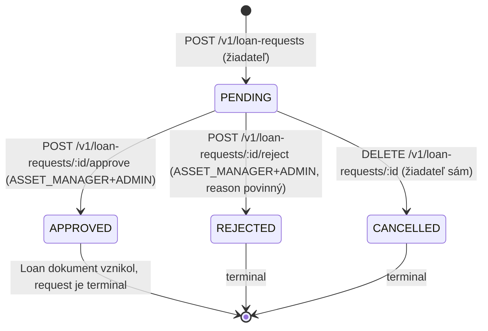
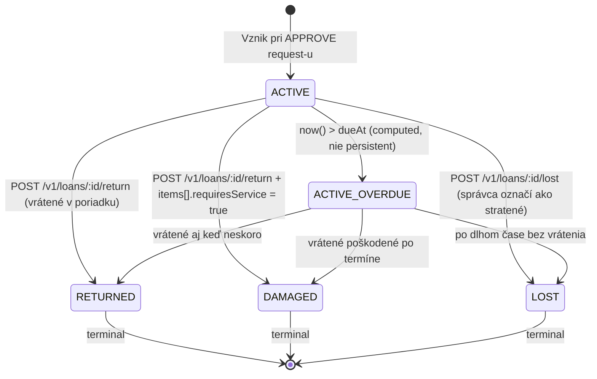

<!--
SPDX-FileCopyrightText: 2026 Ján Letko / LTK Solutions
SPDX-License-Identifier: CC-BY-4.0
-->

# 0012. Loans state machine + Slice #5 MVP scope

|                   |                                                                                                                                                                                                                                                                                                                                                        |
| ----------------- | ------------------------------------------------------------------------------------------------------------------------------------------------------------------------------------------------------------------------------------------------------------------------------------------------------------------------------------------------------ |
| **Status**        | ✅ Accepted                                                                                                                                                                                                                                                                                                                                            |
| **Dátum**         | 2026-05-20                                                                                                                                                                                                                                                                                                                                             |
| **Autori**        | Ján Letko, Claude Opus 4.7 (LTK Solutions)                                                                                                                                                                                                                                                                                                             |
| **Súvisiace ADR** | [0010 Multi-tenant white-label](0010-multi-tenant-white-label.md), [0005 Mongo native driver](0005-mongo-native-driver.md), [0004 Entra ID](0004-auth-entra-id.md), [0020 Sklad & množstevné položky](0020-stock-and-bulk-items.md) (rozširuje o množstvo), [Functional spec §4.2 Modul vypožičiavania](../functional-spec.md#42-modul-vypožičiavania) |

> **Pozn. (2026-06-01):** [ADR-0026](0026-catalog-requests-and-fulfilment.md) **prepisuje jadro
> tohto ADR** — `LoanRequest` FSM nahradený 7-stavovým katalógovým modelom
> (PENDING→APPROVED→PARTIALLY_FULFILLED→FULFILLED/CLOSED), `LoanRequestItem` zmenený
> z `assetId`-based na `categoryId+quantity`. Approve už nevytvára Loan — vydanie
> prebieha cez `POST /v1/loan-requests/:id/fulfil`. Tento dokument je historický záznam
> pôvodného návrhu; pre aktuálny model čítaj ADR-0026.

> **Pozn. (2026-05-30):** [ADR-0020](0020-stock-and-bulk-items.md) rozširuje tento
> dokument o množstevné (BULK) položky — `LoanRequestItem` dostáva `quantity`,
> `LoanItem` má množstevný variant pre BULK a Loan FSM pribúda stav
> `PARTIALLY_RETURNED`. State machine nižšie platí pre **serializované** položky
> bez zmeny; pri implementácii Slice #5 sa obidva ADR čítajú spolu.

## Kontext

Backend Inventaria má hotových 5 z 6 P0 frontend stránok. Posledné dve (`/loans/request` a `/my-loans`) sú zablokované na **Slice #5 — loans backend**. Schémy v `packages/shared-types/src/schemas/loan.ts` a enum-y v `enums/loan-status.ts` existujú už od slice #1 a navrhujú **bohatý feature set**:

- per-item independent approval (`LoanRequestItem.status` ∈ `PENDING | APPROVED | REJECTED | SUBSTITUTED`),
- per-item substitution (`substitutedWithAssetId`),
- multi-approver routing podľa `Category.approverIds` so scope-om per kategória,
- hromadné zápožičky pre tímy (`teamId` na `LoanRequest`),
- predĺženie zápožičky (`extensionCount`),
- právne protokoly `LoanProtocol` typu `HANDOVER | RETURN | AMENDMENT` s biometric / click / external podpismi a SHA-256 hashom PDF,
- per-item condition tracking pri pickup aj return s fotkami a `requiresService` flagom,
- idempotency keys na žiadostiach.

**Implementácia full-scope** by trvala 2–3 týždne. Pre Slice #5 MVP je to **príliš veľa**. Súčasne nemáme reálneho pilot tenanta a teda nemáme real-world feedback, podľa ktorého by sme tieto pokročilé feature-y dobre navrhli — riziko je, že full-scope navrhneme na **predstavovaného** používateľa, nie na skutočného.

Paralelne sú v schémach **dva multi-tenant bug-y**:

- `LoanRequestSchema` **nemá `organisationId`** field (chýba merge so `OrganisationScopedSchema`).
- `LoanSchema` **nemá `organisationId`** field.

To je porušenie [ADR-0010](0010-multi-tenant-white-label.md) — _žiadny doménový dokument nesmie chýbať `organisationId`_. Musíme to opraviť v rámci Slice #5.

### Obmedzenia

- **Čas**: ~1 týždeň práce (Slice #5 MVP). Slice #5b/c follow-ups bez fixného termínu.
- **Schémy**: nechceme schémy prerábať — len doplniť `organisationId` a nevyhodnocovať fields, ktoré v MVP nepotrebujeme. Schémy zostávajú **forward-compatible** pre Slice #5b/c.
- **Pilot tenant deadline**: chceme byť pripravení na onboarding prvého pilot tenanta v priebehu týždňov, nie mesiacov. MVP loans flow musí byť dostatočne dobrý na manuálne reálne použitie, aj keď bez PDF protokolov.
- **Compliance**: audit log musí pokrývať všetky stavové prechody — GDPR Article 30 inventory predpisuje pseudonymizáciu po 24/60/84 mesiacoch ([ADR Phase D](../milestones/phase-d-eu-compliance.md)).

## Možnosti

### Možnosť A: Full-scope hneď

Implementovať všetko čo schémy predikujú: multi-approver routing, per-item substitution, partial approval, PDF protokoly, quick loan, predĺženie.

- **Plus**: jedna veľká fáza, žiadne follow-up; používateľ vidí finálny produkt.
- **Mínus**: 2–3 týždne, vysoké riziko že tieto features navrhneme zle bez pilot feedback-u; väčší blast radius testov a edge cases; oneskorenie pilot tenant onboarding-u o mesiac.

### Možnosť B: MVP minimalistický (single-item only)

Iba single-item per request, single-approver, žiadne hromadné zápožičky.

- **Plus**: rýchle (~3–5 dní); jednoduchá schéma testov.
- **Mínus**: schéma `LoanRequest.items` je už `z.array(LoanRequestItemSchema).min(1)` — single-item by sme museli **dobrať** umelou kontrolou `items.length === 1`. Pre **SFZ flow** (tréner vyzdvihne 25 dresov + 10 lôpt na jeden protokol; user story US-014) je single-item **nepoužiteľný** — duša projektu sa stratí.

### Možnosť C: Mid-scope MVP (multi-item, zjednodušený approval, bez protokolov)

Multi-item zápožičky **podporujeme** (schéma to už umožňuje). Approval zjednodušený — **akýkoľvek ASSET_MANAGER alebo ADMIN** môže schvaľovať akúkoľvek žiadosť (žiadne kategória-scoped routing); per-item substitution a partial approval **nie sú podporované** (all-or-nothing). PDF protokoly a podpisy **nie sú v MVP** — len JSON state v DB a audit log záznamy. Quick loan **nie je v MVP** — vždy ide request → approve → pickup separátne. OVERDUE je **lazy-computed** pri každom GET, nie persistent flag.

- **Plus**: ~1 týždeň práce; hromadné zápožičky fungujú od začiatku (kľúčová SFZ feature); schéma ostáva forward-compatible pre #5b/c; všetky neimplementované features sú odložené ako "známe odložené", nie "neexistujú".
- **Mínus**: schvaľovateľ má menej finer-grained kontroly (musí REJECT celú žiadosť ak nemôže schváliť všetky položky); žiadne právne protokoly znamenajú že pre formálnu evidenciu (verejný sektor) potrebujeme #5b skôr ako neskoršie.

### Možnosť D: MVP s PDF protokolmi, bez multi-item

Opačný kompromis ako C — single-item ale s plnými PDF protokolmi.

- **Plus**: pre malých tenantov (mestá s 10 zamestnancami) je papier viac dôležitý ako batch flow.
- **Mínus**: SFZ-typu tenant (športový zväz s hromadnými zápožičkami) je v podstate odpísaný; PDF infra (knižnica voľba, render template, sign UX, SHA-256 hash, archive policy) je samostatná epická úloha, ktorá by Slice #5 predĺžila o 2–3 dni — nakoniec by sme skončili na ~1.5 týždňa rovnako ako C, len v inom poradí.

## Rozhodnutie

Zvolili sme **Možnosť C: Mid-scope MVP** s konkrétnymi pravidlami nižšie. Schémy zostávajú nezmenené (okrem pridania chýbajúceho `organisationId`), ale **service vrstva ignoruje fields, ktoré v MVP nepotrebujeme**.

### MVP rozsah — definitívne

| Aspekt                         | MVP rozhodnutie                                                                                                                                                                                  | Slice #5b / #5c                                                                                            |
| ------------------------------ | ------------------------------------------------------------------------------------------------------------------------------------------------------------------------------------------------ | ---------------------------------------------------------------------------------------------------------- |
| **Multi-item per request**     | ✅ Áno (`items.min(1)`, bez horného limitu pre teraz, ale obmedzíme na `items.max(50)` na úrovni validácie)                                                                                      | —                                                                                                          |
| **Approval routing**           | Akýkoľvek `ASSET_MANAGER` alebo `ADMIN` v rámci tenanta môže schváliť                                                                                                                            | Slice #5b: routing podľa `Category.approverIds`; per-category scope na `LoanRequest.approvers[]`           |
| **Per-item substitution**      | ❌ Nie. `LoanRequestItem.status` ostáva v schéme ale MVP ho nepoužíva (vždy `PENDING` → null po prechode). `substitutedWithAssetId` ostáva `null`.                                               | Slice #5c                                                                                                  |
| **Partial approval**           | ❌ All-or-nothing. Ak nemôže schváliť všetky položky, schvaľovateľ REJECTNE celú žiadosť s reason-om; user podá novú žiadosť s menšou množinou.                                                  | Slice #5b                                                                                                  |
| **Hromadné žiadosti pre tímy** | ❌ Žiadny `Team` entity. `LoanRequest.teamId` ostáva v schéme ale MVP ho vždy zapisuje ako `null`.                                                                                               | Po `Team` entity (Slice #6+)                                                                               |
| **Predĺženie zápožičky**       | ❌ Žiadny endpoint. `extensionCount` ostáva v schéme ale vždy `0`.                                                                                                                               | Slice #5b                                                                                                  |
| **PDF protokoly + podpisy**    | ❌ Žiadne `LoanProtocol` dokumenty sa v MVP nevytvárajú. Schéma `LoanProtocolSchema` ostáva v `packages/shared-types`, ale repository, service a routes pre protocols **nie sú v Slice #5 MVP**. | Slice #5b (HANDOVER + RETURN PDF + click-to-sign), Slice #5c (biometric + amendments)                      |
| **Quick loan** (US-017)        | ❌ Žiadny `POST /v1/loans/quick`. Request → approve → pickup vždy ako separátne 3 kroky.                                                                                                         | Slice #5b                                                                                                  |
| **Damage flow**                | ✅ MVP podporuje `requiresService: boolean` + text note na `LoanItemCondition.atReturn`. **Bez photo upload** (attachments infra nie je v MVP).                                                  | Slice #5b: photo upload + IN_SERVICE status flip + servisný workflow                                       |
| **OVERDUE**                    | ✅ **Lazy-computed** pri každom GET — server porovnáva `now()` s `dueAt` a vracia `OVERDUE` ako computed status; **bez persistent DB flag-u**.                                                   | Slice #5b: notification cron (denne / týždenne) → vtedy môže byť aj persistent flag pre rýchle filtrovanie |
| **Email notifikácie**          | ❌ Žiadne emaily. Audit log obsahuje záznamy o všetkých prechodoch.                                                                                                                              | Slice #5b (po Slice #6 SMTP/Graph integrácia)                                                              |

### State machine — `LoanRequest`

Stavy: `PENDING → { APPROVED | REJECTED | CANCELLED }`. Po `APPROVED` vzniká `Loan` dokument.



**Pravidlá prechodov:**

1. **`POST /v1/loan-requests`** — vytvorenie žiadosti.
   - Žiadateľ = aktuálny user (z JWT).
   - Validácia: `plannedFrom < plannedTo`, `plannedFrom >= now()` (nemôžem si požičať vec pre minulosť), `items.length ∈ [1, 50]`.
   - Pre každý asset v `items`: musí byť v stave `AVAILABLE`, musí patriť do toho istého tenantu, nesmie byť `deletedAt != null` (soft-deleted).
   - **Reservation**: všetky assets prejdú `AVAILABLE → RESERVED` v rovnakej Mongo transakcii ako vytvorenie request-u. Ak ktorýkoľvek asset nie je `AVAILABLE`, transakcia padne, request sa nevytvorí, error vráti zoznam non-available assets.
   - Audit log entry: `loan_request.created` s `dataCategories: ['workforce_management']`, `legalBasis: 'legitimate_interest'`.

2. **`POST /v1/loan-requests/:id/approve`** — schválenie.
   - Authorize: `ASSET_MANAGER` alebo `ADMIN` v rámci tenanta.
   - Pre-conditions: request `status === 'PENDING'`, všetky `items.assetId` stále `RESERVED` (sanity check).
   - **Loan creation** v rovnakej transakcii: vytvorí sa `Loan` dokument s `status = 'ACTIVE'`, `requestId = :id`, `borrowerId = request.requesterId`, `pickedUpAt = now()`, `handedOverBy = currentUserId`, `dueAt = request.plannedTo`. Všetky `items.assetId` prejdú `RESERVED → BORROWED`.
   - Request prejde `PENDING → APPROVED` a dostane `resultingLoanId`.
   - **Pozor**: v MVP **schválenie = okamžité prevzatie** (žiadny medzistav „APPROVED, čaká na pickup"). Toto je vedome zjednodušujúce; v Slice #5b oddelíme APPROVE od PICKUP keď budú PDF protokoly potrebovať physical sign-off.
   - Audit log entry: `loan_request.approved` + `loan.created` (dva záznamy, atomicky v transakcii).

3. **`POST /v1/loan-requests/:id/reject`** — zamietnutie.
   - Authorize: `ASSET_MANAGER` alebo `ADMIN`.
   - Pre-conditions: request `status === 'PENDING'`.
   - Body: `{ reason: string }` (povinné, min 5 znakov, max 1000).
   - **Reservation release** v rovnakej transakcii: všetky `items.assetId` prejdú `RESERVED → AVAILABLE`.
   - Request prejde `PENDING → REJECTED` s `rejectionReason`.
   - Audit log entry: `loan_request.rejected`.

4. **`DELETE /v1/loan-requests/:id`** — zrušenie žiadateľom.
   - Authorize: iba žiadateľ (`request.requesterId === currentUserId`) **alebo** `ADMIN`.
   - Pre-conditions: request `status === 'PENDING'`.
   - **Reservation release** ako pri reject.
   - Request prejde `PENDING → CANCELLED`.
   - Audit log entry: `loan_request.cancelled`.

### State machine — `Loan`

Stavy: `ACTIVE → { RETURNED | DAMAGED | LOST }`. Persistent v DB. `OVERDUE` je **derived** computed pri GET response, nie persistent.



> `ACTIVE_OVERDUE` v diagrame je vizuálny stav pre UX — **v DB** je status stále `ACTIVE`. API response polia: `status: 'ACTIVE'`, `isOverdue: boolean` (computed: `now() > dueAt && status === 'ACTIVE'`).

**Pravidlá prechodov:**

1. **`POST /v1/loans/:id/return`** — vrátenie.
   - Authorize: `ASSET_MANAGER` alebo `ADMIN` (správca skladu, ktorý prijíma vrátený majetok).
   - Pre-conditions: loan `status === 'ACTIVE'`.
   - Body: `ReturnLoanInput` z `loan.ts` — `returnedTo`, `items[]` so stavom za každú položku, voliteľné `notes`.
   - **Asset state recovery** v rovnakej transakcii:
     - Ak `items[i].requiresService === true` → asset `BORROWED → IN_SERVICE`.
     - Inak → asset `BORROWED → AVAILABLE`.
   - Loan terminal status:
     - Ak ktorékoľvek `items[i].requiresService === true` → loan `ACTIVE → DAMAGED`.
     - Inak → loan `ACTIVE → RETURNED`.
   - `returnedAt = now()`, `returnedTo` z body.
   - Audit log: `loan.returned` (alebo `loan.damaged`).

2. **`POST /v1/loans/:id/lost`** — označenie stratené.
   - Authorize: `ASSET_MANAGER` alebo `ADMIN`.
   - Pre-conditions: loan `status === 'ACTIVE'`.
   - Body: `{ reason: string }` (povinné).
   - **Asset state**: všetky `items[i].assetId` prejdú `BORROWED → LOST`.
   - Loan: `ACTIVE → LOST`.
   - Audit log: `loan.lost` s `severity: 'WARN'`.

### Endpoint inventory — MVP

| Method   | Path                            | Body                                                      | Roles                                                                         |
| -------- | ------------------------------- | --------------------------------------------------------- | ----------------------------------------------------------------------------- |
| `POST`   | `/v1/loan-requests`             | `CreateLoanRequestInput`                                  | EMPLOYEE+                                                                     |
| `GET`    | `/v1/loan-requests`             | query: `status`, `requesterId`, `skip`, `limit`           | ASSET_MANAGER+ADMIN (vidia všetky); EMPLOYEE+ vidí len `requesterId === self` |
| `GET`    | `/v1/loan-requests/:id`         | —                                                         | žiadateľ ALEBO ASSET_MANAGER+ADMIN                                            |
| `POST`   | `/v1/loan-requests/:id/approve` | —                                                         | ASSET_MANAGER, ADMIN                                                          |
| `POST`   | `/v1/loan-requests/:id/reject`  | `{ reason: string }`                                      | ASSET_MANAGER, ADMIN                                                          |
| `DELETE` | `/v1/loan-requests/:id`         | —                                                         | žiadateľ ALEBO ADMIN                                                          |
| `GET`    | `/v1/loans`                     | query: `status`, `borrowerId`, `assetId`, `skip`, `limit` | ASSET_MANAGER+ADMIN (všetky); EMPLOYEE+ filter `borrowerId === self`          |
| `GET`    | `/v1/loans/my`                  | query: `status`, `skip`, `limit`                          | EMPLOYEE+ (= `borrowerId === self`)                                           |
| `GET`    | `/v1/loans/:id`                 | —                                                         | borrower ALEBO ASSET_MANAGER+ADMIN                                            |
| `POST`   | `/v1/loans/:id/return`          | `ReturnLoanInput`                                         | ASSET_MANAGER, ADMIN                                                          |
| `POST`   | `/v1/loans/:id/lost`            | `{ reason: string }`                                      | ASSET_MANAGER, ADMIN                                                          |

**Bez quick-loan endpointu**, bez extend, bez approve-but-not-pickup separácie. Všetko v MVP je v 11 endpointoch.

### Schema fixes — multi-tenant compliance

Pred implementáciou Slice #5 spravíme **`packages/shared-types` schema fix**:

```ts
// loan.ts — pred fix
export const LoanRequestSchema = BaseDocumentSchema.merge(SoftDeleteSchema).extend({ ... });

// loan.ts — po fix
export const LoanRequestSchema = BaseDocumentSchema
  .merge(SoftDeleteSchema)
  .merge(OrganisationScopedSchema)  // ← chýbalo
  .extend({ ... });

// loan.ts — rovnaký fix pre LoanSchema
export const LoanSchema = BaseDocumentSchema
  .merge(SoftDeleteSchema)
  .merge(OrganisationScopedSchema)  // ← chýbalo
  .extend({ ... });
```

Rovnaký fix aj pre `LoanProtocolSchema` (aj keď ho v MVP nepoužívame, je v shared-types a má chýbať `organisationId`). To je súčasť Slice #5 K1 (schema fixes).

**Compound indexy** ktoré pridáme:

```js
// loan_requests
{ organisationId: 1, status: 1, requesterId: 1, createdAt: -1 }
{ organisationId: 1, "items.assetId": 1 }  // pre detection že asset má pending request

// loans
{ organisationId: 1, status: 1, borrowerId: 1, dueAt: 1 }
{ organisationId: 1, "items.assetId": 1, status: 1 }  // pre check že asset má active loan
```

### Audit log entries — MVP

| Action                   | `entityType`  | `severity` | `dataCategories`           | `legalBasis`          |
| ------------------------ | ------------- | ---------- | -------------------------- | --------------------- |
| `loan_request.created`   | `LoanRequest` | INFO       | `['workforce_management']` | `legitimate_interest` |
| `loan_request.approved`  | `LoanRequest` | INFO       | `['workforce_management']` | `legitimate_interest` |
| `loan_request.rejected`  | `LoanRequest` | INFO       | `['workforce_management']` | `legitimate_interest` |
| `loan_request.cancelled` | `LoanRequest` | INFO       | `['workforce_management']` | `legitimate_interest` |
| `loan.created`           | `Loan`        | INFO       | `['workforce_management']` | `legitimate_interest` |
| `loan.returned`          | `Loan`        | INFO       | `['workforce_management']` | `legitimate_interest` |
| `loan.damaged`           | `Loan`        | WARN       | `['workforce_management']` | `legitimate_interest` |
| `loan.lost`              | `Loan`        | WARN       | `['workforce_management']` | `legitimate_interest` |

## Dôsledky

### Pozitívne

- **Rýchle dokončenie Slice #4**: posledné dve P0 frontend stránky (`/loans/request`, `/my-loans`) sa odblokujú v priebehu týždňa.
- **Pilot tenant ready**: prvý pilot dostane funkčný end-to-end flow (request → approve → return) ktorý pokrýva 80 % SFZ-like a municipálnych use case-ov.
- **Real-world feedback driven**: pokročilé features (multi-approver routing, substitution, predĺženie) navrhneme v Slice #5b **až po** pilot feedback-u — minimalizujeme risk over-engineering-u.
- **Schémy forward-compatible**: žiadny breaking change v `LoanRequestSchema` ani `LoanSchema` neskôr — len doplníme service logiku.
- **Multi-tenant compliance fix**: opravíme dva chýbajúce `organisationId` na `Loan` a `LoanRequest` ([ADR-0010](0010-multi-tenant-white-label.md) consistency).
- **Hromadné zápožičky fungujú**: SFZ-špecifická user story US-014 (tréner s 25 dresmi + 10 loptami) **je v MVP funkčná**, nezačíname zlomenou predstavou.
- **Audit log → GDPR Article 30**: každý prechod logujeme so správnymi metadata fields, pseudonymizácia po 24/60/84 mesiacoch automaticky bude fungovať aj pre loans.

### Negatívne / kompromisy

- **Žiadne PDF protokoly v MVP**: pre verejný sektor (mesto, VÚC) môže byť papier formálnou požiadavkou. Slice #5b musí prísť **skoro** ak pilot tenant je verejný sektor. Pre súkromné kluby a školy je MVP postačujúce.
- **All-or-nothing approval**: schvaľovateľ nemôže povedať „dám ti 4 z 5 dresov, šiesty nemáme". Musí REJECT-núť celú žiadosť a user pošle znovu. UX rough edge, ale akceptovateľný.
- **Schvaľovať môže ktorýkoľvek `ASSET_MANAGER`**: porušuje princíp „kategória ma `approverIds`, nech schvaľujú len oni". Pre malého pilot tenanta s 1–3 ASSET_MANAGER-mi je to OK; pre väčších tenantov v Slice #5b zaviedeme routing.
- **Approve = immediate pickup**: žiadny medzistav „APPROVED, ale ešte sa neprevzal". Pre tenantov so vzdialeným skladom (skladnik schvaľuje ráno, user príde poobede) je toto problém. Slice #5b: oddeliť `APPROVE` a `PICKUP` endpointy, asset state ide `RESERVED → APPROVED_HOLD → BORROWED`.
- **No quick loan v MVP**: User story US-017 (správca vidí employee-a fyzicky pri sebe, chce mu hneď dať vec) nie je pokrytý. Workaround: employee otvorí svoj telefón, podá žiadosť, správca okamžite schváli — funguje ale s overhead-om.
- **Lazy OVERDUE compute**: každý GET prepočíta. Pri stovkách aktívnych loans v list view môže byť drobný perf hit (zanedbateľný), ale **neexistuje persistent flag** ktorý by sme mohli použiť pre filter „daj mi všetky overdue". Slice #5b: hybrid (lazy compute + nightly cron pre notification + persistent flag).

### Riziká, ktoré treba sledovať

- **Reservation race condition**: dvaja používatelia podajú žiadosť o ten istý asset v rovnakom milisekunde. Mongo `findOneAndUpdate({ _id, status: 'AVAILABLE' }, { $set: { status: 'RESERVED' } })` musí byť atomické. **Testovať explicitne**: concurrent request test ktorý overí že druhý dostane error a request sa nevytvorí.
- **PENDING request bez ďalšej akcie**: schvaľovateľ ignoruje request 30 dní → asset je „zaseknutý" v `RESERVED`. **Mitigácia**: tech-debt entry pre Slice #5b — auto-expire cron job ktorý cancelluje PENDING request po 7 dňoch a vráti assets do `AVAILABLE`. **MVP**: pridáme manuálny `DELETE /v1/loan-requests/:id` ktorý môže spraviť ADMIN aj keď nie je žiadateľ (ADMIN cleanup pre stuck requests).
- **Transakcie cez kolekcie**: jeden request/approve/return touch viaceré dokumenty cez 2–3 kolekcie (`loan_requests` / `loans` / `assets` / `audit_log`). Atlas Flex podporuje multi-document ACID transakcie cez `withSession` API — už používame v Slice #2b. Treba potvrdiť že `audit_log` insert ide v rovnakej transakcii ako business state change (atomicity v Phase D už takto funguje).
- **Lazy OVERDUE compute v indexovaných queries**: ak v Slice #5b pridáme `GET /v1/loans?status=OVERDUE`, bez persistent flag-u **nemôžeme** efektívne indexovať. Plánovaný refactor v #5b: pridať `isOverdueCached: boolean` field aktualizovaný cron-om denne v polnoc UTC.
- **Frontend `/loans/request` UX pre hromadné zápožičky**: pridanie 25 dresov do žiadosti v UI vyžaduje QR sken alebo bulk-select v `/assets` ktorý odošle assets array do `/loans/request` form-y. UX musí riešiť error case „asset nie je AVAILABLE" gracefully (možno reserved-by-other, dispose, lost). To je frontend úloha pre Slice #4 finálne 2 P0.

## Sub-task breakdown — Slice #5 MVP

Implementačný plán, ~1 týždeň (5–7 working days). Každý K-blok môže byť samostatný commit.

| Blok   | Popis                                                                                                                                                                                                                                            | Odhad  | Model  |
| ------ | ------------------------------------------------------------------------------------------------------------------------------------------------------------------------------------------------------------------------------------------------ | ------ | ------ |
| **K1** | Schema fixes v `packages/shared-types`: pridať `OrganisationScopedSchema` merge do `LoanRequestSchema`, `LoanSchema`, `LoanProtocolSchema`. Update `index.ts` exports. Regen `openapi.json`.                                                     | 30 min | Haiku  |
| **K2** | `LoanRequestsRepository` + `LoansRepository` (Mongo native, OrganisationScopedRepository base). Indexy. Helper methods: `findActiveByAsset`, `findPendingByAsset`.                                                                               | 2–3 h  | Sonnet |
| **K3** | `loans.service.ts` — state machine logic. Transakčné helper-y: `createLoanRequestWithReservation`, `approveRequestAndCreateLoan`, `rejectRequestAndReleaseAssets`, `returnLoan`, `markLoanLost`. Každý zapisuje audit log v rovnakej transakcii. | 1 deň  | Sonnet |
| **K4** | `loan-requests.routes.ts` + `loans.routes.ts` — Fastify routes pre 11 MVP endpointov. RBAC guard cez `request.user.roles`. OpenAPI schema attachment.                                                                                            | 4–5 h  | Sonnet |
| **K5** | **Tests** — state transitions (~25), RBAC (~15), reservation race (~3), all-or-nothing approval (~5), lazy OVERDUE compute (~3), cross-tenant isolation (~5). Cieľ: ~50–55 nových testov; existujúce 327 musí ostať green.                       | 1 deň  | Sonnet |
| **K6** | OpenAPI export update + frontend type regen (`apps/web/api-types.ts` regenerovaný cez `pretypecheck` hook už existujúci). Sanity check že `useLoans()`, `useMyLoans()`, `useCreateLoanRequest()`, `useApproveRequest()` hooks sa dajú generovať. | 1 h    | Haiku  |
| **K7** | Manuálny smoke test cez `curl` alebo Bruno: create request → approve → list my loans → return. Doc do `docs/sessions/2026-05-XX-day-summary.md`.                                                                                                 | 1 h    | Haiku  |
| **K8** | Milestone doc `docs/milestones/slice-5-loans-mvp.md`: zoznam endpointov, ADR-0012 cross-link, tests count, deferral list pre #5b/#5c, known limitations.                                                                                         | 1 h    | Haiku  |

**Spolu**: ~5–7 working days. Po dokončení Slice #5 môžeme rovno ísť do **Slice #4 final 2 pages** (`/loans/request` + `/my-loans`) ktoré odblokuje to čo právo teraz čaká.

## Referencie

- [ADR-0010 Multi-tenant white-label architektúra](0010-multi-tenant-white-label.md) — `organisationId` invariant
- [ADR-0005 Mongo native driver + Repository pattern](0005-mongo-native-driver.md) — OrganisationScopedRepository pattern pre Slice #5 K2
- [Functional spec §4.2 Modul vypožičiavania](../functional-spec.md#42-modul-vypožičiavania) — pôvodný user story plán
- [User stories US-010–US-017](../functional-spec.md#epic-2-vypožičiavanie) — implementované US-010, US-011, US-012-čiastočne (bez QR sken/PDF protokol), US-014 (multi-item), US-015 (return s damage), US-013/US-016/US-017 odložené na #5b
- [Phase D Milestone — GDPR Article 30](../milestones/phase-d-eu-compliance.md) — audit log shape ktorý loans budú produkovať
- [Slice #2b — Assets CRUD + transactions](../milestones/) — existujúci pattern pre Mongo `withSession` transakcie
- [packages/shared-types/src/schemas/loan.ts](../../packages/shared-types/src/schemas/loan.ts) — existujúce schémy
- [packages/shared-types/src/enums/loan-status.ts](../../packages/shared-types/src/enums/loan-status.ts) — `LoanRequestStatus`, `LoanStatus` enum-y
