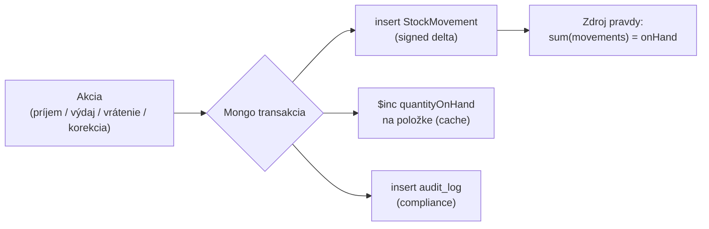
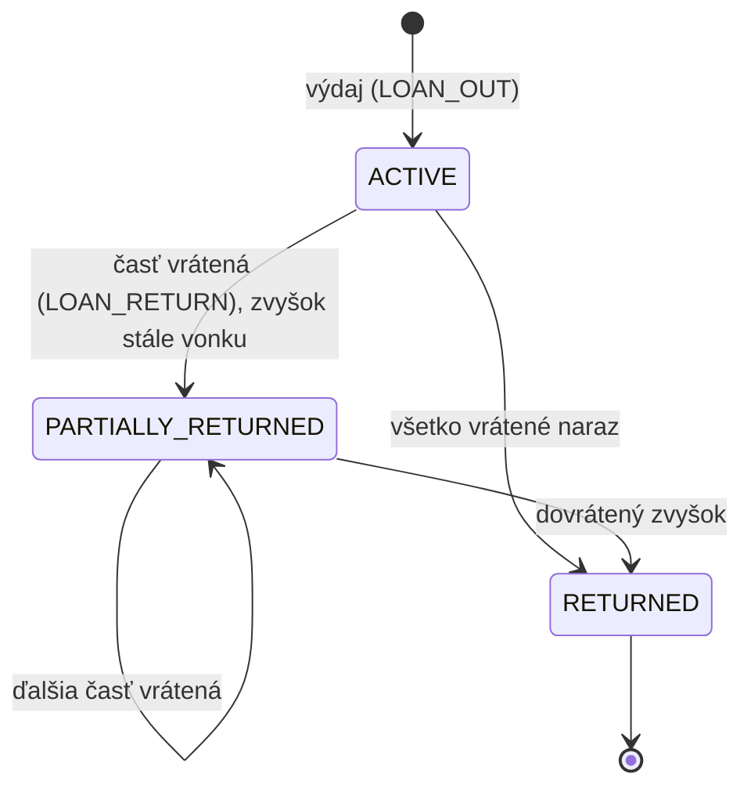

<!--
SPDX-FileCopyrightText: 2026 Ján Letko / LTK Solutions
SPDX-License-Identifier: CC-BY-4.0
-->

# 0020. Skladové množstevné položky — `trackingMode` + StockMovement ledger

|                   |                                                                                                                                                                         |
| ----------------- | ----------------------------------------------------------------------------------------------------------------------------------------------------------------------- |
| **Status**        | ✅ Accepted                                                                                                                                                             |
| **Dátum**         | 2026-05-30 (Proposed), 2026-05-31 (Accepted)                                                                                                                            |
| **Autori**        | Ján Letko, Claude Opus 4.8 (LTK Solutions)                                                                                                                              |
| **Súvisiace ADR** | [0012 Loans state machine](0012-loans-state-machine.md), [0010 Multi-tenant](0010-multi-tenant-white-label.md), [0005 Mongo native driver](0005-mongo-native-driver.md) |

> **Pozn. (2026-06-01):** [ADR-0026](0026-catalog-requests-and-fulfilment.md) integruje BULK
> vydávanie do toku vybavovania katalógovej žiadosti — `POST /v1/loan-requests/:id/fulfil`
> mapuje položky žiadosti na BULK+množstvo (LOAN_OUT pohyb) alebo SERIALIZED kusy.
>
> **Pozn. (2026-07-16):** `LOAN_OUT`/`LOAN_RETURN` pohyby, ktoré tento ADR navrhoval,
> boli do toho času iba **enum hodnoty bez zápisovej cesty** — vydanie/vrátenie BULK
> položky nikdy nezapísalo `StockMovement` a `quantityOnHand` sa nikdy nezmenilo
> (zistené na priamu otázku správcu po nasadení viac-BULK vydania z ADR-0026). Doplnené:
> `StockService.recordLoanOut()`/`recordLoanReturn()` (participujú na existujúcej Mongo
> transakcii `LoansService` cez voliteľný `session` parameter, nezakladajú vlastnú),
> `LoanItem.quantity` (nenull len pre BULK/EXTRA_BULK riadky — potrebné pri vrátení,
> aby `returnLoan` vedel, koľko vrátiť na sklad), a `LoansService.returnLoan()` teraz
> pre BULK riadky (`quantity != null`) preskočí status/`currentLoanId` update na asset
> doku (ten sa pre BULK nikdy nemenil, viď bod 3 nižšie) a namiesto toho zapíše
> `LOAN_RETURN`. Záporný-zostatok guard z `StockService.recordMovement()` (čl. „Riziká“
> nižšie) je od teraz **reálne využitý** cez tento tok — ADR-0026 zrušil strop na
> žiadanom množstve (žiadosť je len orientačná), ale fyzický sklad je tvrdý limit.
> Podrobnosti: [ADR-0026 dodatok](0026-catalog-requests-and-fulfilment.md).
> `TRANSFER`/`STOCKTAKE`/`WRITE_OFF` (Fáza 2) ostávajú nezmenené, mimo scope.

## Kontext

Súčasný dátový model je **striktne serializovaný**: každý fyzický kus má
vlastný `Asset` dokument s vlastným inventárnym číslom, vlastnou históriou
a vlastnou kondíciou. Komentár v `asset.ts` to hovorí doslova — _„15× rovnaký
dres = 15 záznamov"_. To je správne pre majetok, ktorý chceme sledovať kus po
kuse (notebook, defibrilátor, dron, konkrétne drahé bránky).

Reálne použitie u cieľových tenantov (SFZ, mestá, kluby, školy) však obsahuje
aj **hromadný, zameniteľný (fungibilný) majetok**, kde sledovanie kus po kuse
nedáva zmysel: tréningové kužele, rozlišovacie dresy, lopty, fľaše, spotrebný
materiál. Pre tieto položky správca chce:

1. evidovať **jednu položku s počtom kusov** (30 kužeľov = 1 záznam, množstvo 30),
2. mať **sklad a skladové pohyby** — príjem, výdaj, vrátenie, korekcia,
3. priebežne **požičať časť** zásoby a priebežne ju **vrátiť** (požičia 10, vráti 7
   teraz, 3 neskôr),
4. žiadať **viac druhov a počtov** majetku na jednu žiadosť.

Potreba č. 4 je z veľkej časti už pokrytá — `LoanRequest.items[]` aj `Loan.items[]`
sú už polia položiek (ADR-0012, Možnosť C). Chýba im len rozmer **množstva** na
riadku. Potreby 1–3 sú nový koncept.

### Načasovanie — prečo teraz

Toto je aditívna zmena v najlepšom možnom momente:

- **Loans nie sú postavené.** ADR-0012 definuje Slice #5 MVP, ale implementácia
  ešte neexistuje. Schémy `loan.ts` sú zatiaľ len návrh. Množstevný rozmer vieme
  zapracovať do dizajnu Slice #5 od začiatku namiesto prerábania.
- **Assety sú live, ale zmena je aditívna.** Pridanie `trackingMode` s defaultom
  `SERIALIZED` znamená, že **všetky existujúce assety ostávajú platné bez migrácie**
  — sú to serializované položky s množstvom 1.
- Súvisí to s princípom z ADR-0012: _pilot pred loans dizajnom_. Reálny pomer
  serialized vs bulk u pilota informuje, koľko skladovej funkcionality treba do v1.

### Obmedzenia

- Solo dev, pred prvým pilotom — **reálne riziko over-engineeringu** smerom k plnému
  skladovému ERP. Model musí byť správny, ale rozsah implementácie fázovaný.
- Schémy sú jediný zdroj pravdy (Zod → TS → JSON Schema → Mongo `$jsonSchema` →
  OpenAPI). Zmena modelu sa premietne všade — návrh musí byť forward-compatible.
- Transakčná disciplína (ADR-0005) a audit log (Phase D) sú už zavedené; nový model
  ich musí rešpektovať, nie obísť.

## Možnosti

### Paradigma — ako reprezentovať hromadné položky

#### Možnosť A: Všetko serializované (status quo, force)

Aj kužele evidovať kus po kuse (30 záznamov).

- Plus: jeden model, žiadna zmena.
- Mínus: nepoužiteľné — nikto nezadá inventárne číslo 30 kužeľom; žiadosť „kužeľ #17"
  je absurdná; duša správy hromadného materiálu sa stráca.

#### Možnosť B: Všetko množstevné (force)

Zrušiť per-kus identitu, všetko len počet.

- Plus: jeden model, jednoduché počítanie.
- Mínus: stratíme sériové číslo, individuálnu históriu zápožičiek, kondíciu a záruku
  konkrétneho notebooku — čo je celý zmysel evidencie drahého majetku.

#### Možnosť C: Dva oddelené koncepty — `Asset` (serializovaný) + `StockItem` (množstevný)

Dve samostatné kolekcie a dva samostatné toky všade (zoznamy, žiadosti, loans, reporty).

- Plus: každý model ostáva čistý a jednoduchý, žiadne nullable pre druhý režim.
- Mínus: zdvojené kódové cesty naprieč celou appkou; žiadosť/loan musí miešať dva typy
  riadkov; používateľ rieši „kde to nájdem" dvakrát; väčšia údržbová plocha pre solo dev.

#### Možnosť D: Jeden model s `trackingMode` (zvolené)

Položka má `trackingMode: SERIALIZED | BULK`. Serializovaná = dnešný asset (množstvo 1).
Hromadná = jeden záznam s množstvom, bez per-kus identity.

- Plus: jeden zoznam, jeden tok žiadostí s množstvom na riadku; existujúce assety sú
  validné bez migrácie (default SERIALIZED); spoločná kategória/lokalita/štítky.
- Mínus: model je „modálny" — niektoré polia platia len pre jeden režim (inventárne
  číslo per kus, status FSM); validačné pravidlá závisia od `trackingMode`.

### Zdroj pravdy pre množstvo (sub-vidlica)

#### Level 1: Jednoduché počítadlo

Na položke `quantityTotal` + `quantityAvailable`, žiadna história. Výdaj zníži, vrátenie zvýši.

- Plus: rýchle postaviť, pokryje „mám 30 dresov, 10 je vonku".
- Mínus: žiadna auditovateľnosť, žiadne korekcie s dôvodom, žiadny shrinkage report;
  retrofit na ledger neskôr je bolestivý (históriu, ktorá nikdy nevznikla, nezrekonštruuješ).

#### Level 2: StockMovement ledger ako zdroj pravdy (zvolené)

Append-only kolekcia pohybov; `quantityOnHand` na položke je len cache odvodená sumou
pohybov, aktualizovaná v rovnakej transakcii ako pohyb.

- Plus: plná auditovateľnosť a rekonštruovateľnosť; korekcie s dôvodom a aktérom;
  sedí na existujúcu transakčnú + audit disciplínu; žiadny bolestivý retrofit neskôr.
- Mínus: o niečo viac práce ako počítadlo; treba strážiť konzistenciu cache vs ledger.

## Rozhodnutie

Zvolili sme **Možnosť D (`trackingMode`) + Level 2 (StockMovement ledger)**.

### 1. `trackingMode` na položke, default `SERIALIZED`

```
trackingMode: 'SERIALIZED' | 'BULK'   // default 'SERIALIZED'
```

- **SERIALIZED** = presne dnešný `Asset`. Množstvo je implicitne 1. Má per-kus
  `inventoryNumber`, `serialNumber`, `condition`, `currentLoanId`, prechádza
  status FSM z ADR-0012 (`AVAILABLE → RESERVED → BORROWED → …`).
- **BULK** = jeden záznam reprezentujúci N zameniteľných kusov. Nemá per-kus
  identitu ani status FSM (viď bod 3).
- **Default `SERIALIZED` ⇒ žiadna migrácia.** Všetky existujúce assety sú validné.

`inventoryNumber` ostáva povinné aj pre BULK, ale mení sa jeho **význam**: nie je to
kód jedného kusu, ale **kód položky/SKU** pre celú zásobu (napr. `KUZ-2026-001` pre
celú zásobu kužeľov). Regex aj generátor (prefix+rok+poradie) ostávajú nezmenené.

### 2. StockMovement ledger je zdroj pravdy pre množstvo

Nová kolekcia `stock_movements` (organisation-scoped, append-only):

| Pole                                                                        | Typ                   | Popis                                                     |
| --------------------------------------------------------------------------- | --------------------- | --------------------------------------------------------- |
| `itemId`                                                                    | ObjectId              | Položka (musí mať `trackingMode === 'BULK'`)              |
| `type`                                                                      | enum (viď nižšie)     | Druh pohybu                                               |
| `quantity`                                                                  | number (signed delta) | `+` príjem, `−` výdaj. `sum(quantity)` = `quantityOnHand` |
| `balanceAfter`                                                              | number                | Cached zostatok po pohybe (pre audit a rýchle zobrazenie) |
| `reason`                                                                    | string \| null        | Dôvod (povinný pri `ADJUSTMENT`/`WRITE_OFF`)              |
| `loanId`                                                                    | ObjectId \| null      | Ak pohyb súvisí so zápožičkou (`LOAN_OUT`/`LOAN_RETURN`)  |
| `locationId`                                                                | ObjectId              | Sklad/lokalita pohybu                                     |
| + `BaseDocument` + `OrganisationScoped` + `createdBy` (kto pohyb zaúčtoval) |

**Typy pohybov — MVP (Fáza 1):**

```
RECEIPT       // príjem na sklad (+)
LOAN_OUT      // výdaj na zápožičku (−)
LOAN_RETURN   // vrátenie zo zápožičky (+)
ADJUSTMENT    // ručná korekcia inventúry (±, dôvod povinný)
```

**Odložené (Fáza 2):** `TRANSFER` (presun medzi lokalitami), `STOCKTAKE`
(inventúrne zúčtovanie), `WRITE_OFF` (odpis/strata), prípadne šarže/expirácie.

`quantityOnHand` je **cache na položke**, aktualizovaná `$inc`-om v **rovnakej Mongo
transakcii** ako insert pohybu. Zdroj pravdy je ledger; cache slúži na rýchle dotazy.
Konzistencia sa dá kedykoľvek overiť/rekonštruovať `sum(quantity)` cez `stock_movements`.



> StockMovement je **doménový (business) ledger**, oddelený od `audit_log`
> (compliance). Pohyb je samotný účtovný záznam; audit_log entry je navyše pre
> GDPR Article 30 stopu. Obidva vznikajú v tej istej transakcii.

### 3. BULK nepoužíva status FSM — má množstevné účtovníctvo

Pre SERIALIZED ostáva status FSM z ADR-0012 (jedna položka je v jednom stave).
Pre BULK to nedáva zmysel — časť zásoby môže byť súčasne dostupná aj požičaná.
Namiesto jedného `status` má BULK položka **odvodené množstvá**:

```
quantityOnHand        // fyzicky na sklade (cache z ledgera)
quantityReserved      // viazané PENDING/APPROVED žiadosťami (odvodené z requests)
quantityOnLoan        // aktuálne vypožičané (odvodené z aktívnych loans)
dostupné na požičanie = quantityOnHand − quantityReserved
```

`quantityReserved` a `quantityOnLoan` sa **počítajú z aktívnych** `loan_requests`
a `loans`, nie sú to samostatné polia (zdroj pravdy = stav žiadostí/zápožičiek).
`status`, `condition`, `currentLoanId` sú pre BULK `null`/nepoužité.

### 4. Žiadosť a zápožička dostávajú množstvo na riadku

- `LoanRequestItem` + `quantity: number` (default 1). Pre SERIALIZED vždy 1.
- `LoanItem` (discriminated podľa režimu položky):
  - **SERIALIZED** — `assetId` + per-kus `condition` (ako dnes).
  - **BULK** — `itemId` + `quantityOut` + akumulujúce `quantityReturned`
    (+ neskôr `quantityDamaged`, `quantityLost`).
- **Rezervácia/výdaj množstva** prebieha atomicky: pri schválení žiadosti o BULK
  položku sa overí `quantityOnHand − quantityReserved ≥ requested`, zaúčtuje sa
  `LOAN_OUT` pohyb a `$dec` cache v jednej transakcii.

### 5. Loan FSM rozšírené o čiastočné vrátenie (revízia ADR-0012)

ADR-0012 mal `ACTIVE → RETURNED | DAMAGED | LOST`. Pre BULL zápožičky pribúda
medzistav, lebo vrátenie môže byť postupné:



- Zápožička ostáva otvorená (`ACTIVE`/`PARTIALLY_RETURNED`), kým
  `sum(quantityReturned) < quantityOut`. Po dovrátení → `RETURNED`.
- Pre čisto SERIALIZED zápožičky sa `PARTIALLY_RETURNED` nepoužije — správanie
  ostáva ako v ADR-0012.
- `DAMAGED`/`LOST` pre BULK sa modelujú množstvom (`quantityDamaged`/`quantityLost`)
  v rámci vrátenia, nie ako terminálny stav celej zápožičky — **detail odložený do
  Fázy 2**, MVP rieši len čistý výdaj/vrátenie množstva.

### Vzťah k ADR-0012

ADR-0020 **dopĺňa**, nenahrádza ADR-0012. Status machine `LoanRequest` (PENDING →
APPROVED/REJECTED/CANCELLED) a Loan FSM pre **serializované** položky ostávajú presne
ako v 0012. ADR-0020 pridáva: `quantity` na `LoanRequestItem`, množstevný `LoanItem`
pre BULK, a stav `PARTIALLY_RETURNED` pre BULK zápožičky. Pri implementácii Slice #5
sa tieto dva ADR čítajú spolu.

## Fázovanie

### Fáza 1 — Foundation (do pilota)

- `trackingMode` na položke + množstevné polia pre BULK
- `stock_movements` kolekcia + repository + 4 MVP typy pohybov (RECEIPT, LOAN_OUT,
  LOAN_RETURN, ADJUSTMENT) s transakčnou cache aktualizáciou
- Obrazovka „Príjem na sklad" (RECEIPT) + ručná korekcia (ADJUSTMENT) pre ADMIN/ASSET_MANAGER
- `quantity` v žiadosti a zápožičke; čiastočné vrátenie BULK
- Zoznam položiek rozlišuje SERIALIZED vs BULK (badge, množstvo v stĺpci)

#### Stav implementácie

**Hotové (Slice #5a K1–K5, 2026-05-30 — backend zelený, CI prechádza):**

- K1 — schémy: `TrackingMode` enum, `StockMovementSchema` (append-only ledger),
  `trackingMode` + `quantityOnHand` na `AssetSchema`, audit log akcie STOCK\_\*
- K2–K5 — `StockMovementsRepository`, `StockService` (`receive`/`adjust`/`reconcile`),
  `stock.routes.ts` (4 endpointy), 18 integračných testov. `reconcile` je diagnostická
  oprava cache voči ledgeru (viď riziká: drift cache vs ledger), nie `STOCKTAKE` z Fázy 2.

**Doplnené 2026-07-16 (LOAN_OUT/LOAN_RETURN wiring):** `LoanItem.quantity`,
`StockService.recordLoanOut`/`recordLoanReturn`, zapojenie do
`LoansService.fulfilLoanRequest`/`returnLoan` v rámci existujúcej transakcie —
viď poznámka na začiatku dokumentu.

**Zostáva z Fázy 1 (frontend):**

- Frontend: obrazovka príjmu/korekcie, badge SERIALIZED vs BULK, množstvo v stĺpci zoznamu
- Čiastočné vrátenie (`PARTIALLY_RETURNED` Loan status, bod 5 vyššie) — dnes vrátenie
  BULK riadku vracia celé zaznamenané `quantity` naraz, nie po častiach

### Fáza 2 — Plný sklad (po pilote, podľa reálnej potreby)

- `TRANSFER` medzi lokalitami, `STOCKTAKE` (inventúra/reconciliation), `WRITE_OFF`
- `quantityDamaged`/`quantityLost` flow pri vrátení BULK
- Minimálne zásoby + upozornenia (low-stock alert)
- Šarže/expirácie pre spotrebný materiál (ak pilot ukáže potrebu)
- Skladové reporty (obrat, shrinkage)

Poradie a presný scope voči Slice #5 (loans) sa doriešia pri plánovaní Slice #5 —
pravdepodobne sa rozdelí na **#5a Sklad foundation** (nezávislé od loans) a
**#5b Loans MVP s množstvom**. Skladová foundation logicky predchádza loans, lebo
loan tok závisí od toho, či je položka serializovaná alebo hromadná.

## Dôsledky

### Pozitívne

- Pokrýva reálny mix majetku cieľových tenantov bez násilného vtláčania do jednej paradigmy
- Existujúce assety ostávajú validné bez migrácie (default SERIALIZED)
- Ledger dáva plnú auditovateľnosť a sedí na existujúce transakčné + audit vzory
- Čiastočné vrátenie (priebežné požičanie/vrátenie) je prirodzený dôsledok modelu
- Forward-compatible: Fáza 2 pridáva typy pohybov a polia, nie breaking change

### Negatívne / kompromisy

- **Dve paradigmy = vetviaca sa logika.** Serializované ide cez status FSM, hromadné
  cez množstevné účtovníctvo. Service, žiadosti, loans a UI musia obe cesty rozlišovať.
  Toto je inherentná zložitosť, nie náhodná — akceptujeme ju vedome.
- BULK nemá `status`/`condition`/`currentLoanId` — tieto polia sú pre BULK `null`,
  čo robí `Asset`/`Item` schému „modálnou" (validita poľa závisí od `trackingMode`).
- `quantityReserved`/`quantityOnLoan` sú odvodené (počítané z requests/loans), nie
  uložené — jednoduchšie na konzistenciu, ale drahšie na dotaz pri mnohých zápožičkách
  (rieši sa indexmi a prípadným cache-om vo Fáze 2).
- Loan FSM dostáva `PARTIALLY_RETURNED` — mierne rozširuje testovaciu maticu z ADR-0012.

### Riziká, ktoré treba sledovať

- **Concurrency na výdaji množstva.** Dvaja schvaľovatelia vydajú z tej istej zásoby
  súčasne. Výdaj musí byť atomický guard: `findOneAndUpdate({ _id, trackingMode: 'BULK' },
...)` s podmienkou na dostupné množstvo, alebo optimistic check v transakcii, ktorá
  padne pri nedostatku. **Testovať explicitne** concurrent výdaj.
- **Drift cache vs ledger.** Ak by sa cache aktualizácia a insert pohybu rozišli (bug
  mimo transakcie), `quantityOnHand` prestane sedieť. Mitigácia: vždy v jednej transakcii
  - diagnostický skript/endpoint na reconciliation (`sum(movements)` vs cache).
- **Záporné množstvo.** Korekcia/výdaj nesmie dostať `quantityOnHand` pod 0 (okrem
  vedomého `WRITE_OFF` vo Fáze 2). Validácia v service vrstve.
- **Over-engineering.** Riziko postaviť plný WMS pred pilotom. Mitigácia: striktne držať
  Fázu 1 minimálnu; Fáza 2 až po reálnom feedbacku.

## Referencie

- [ADR-0012 Loans state machine + Slice #5 MVP](0012-loans-state-machine.md) — doplnené o množstvo
- [ADR-0010 Multi-tenant white-label](0010-multi-tenant-white-label.md) — `organisationId` invariant pre `stock_movements`
- [ADR-0005 Mongo native driver + Repository pattern](0005-mongo-native-driver.md) — transakčný vzor pre cache+ledger
- [packages/shared-types/src/schemas/asset.ts](../../packages/shared-types/src/schemas/asset.ts) — model, ktorý sa rozširuje o `trackingMode`
- [packages/shared-types/src/schemas/loan.ts](../../packages/shared-types/src/schemas/loan.ts) — `LoanRequestItem`/`LoanItem` dostávajú množstvo
- [packages/shared-types/src/enums/asset-status.ts](../../packages/shared-types/src/enums/asset-status.ts) — status FSM (len pre SERIALIZED)
