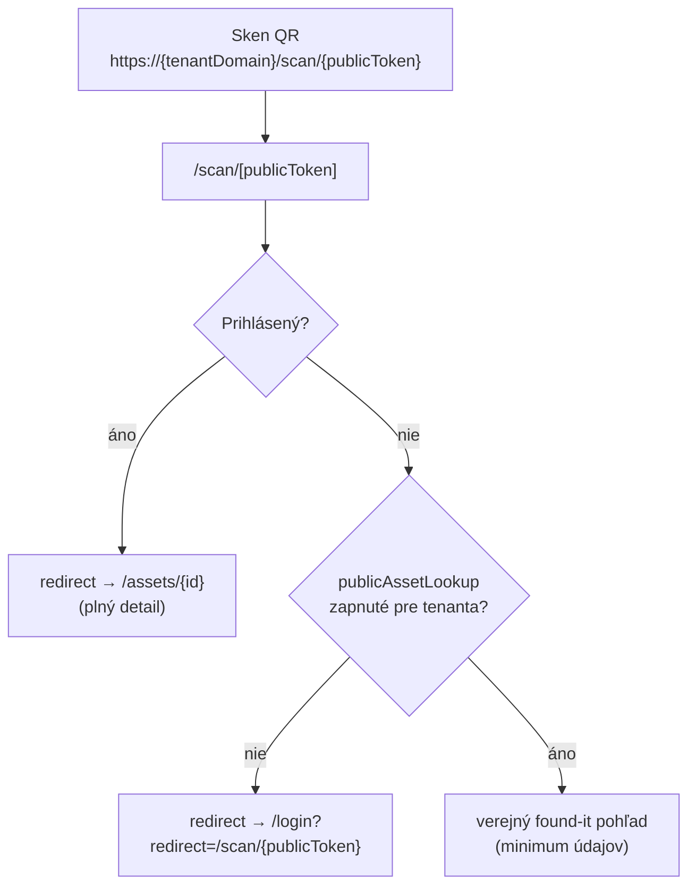

<!--
SPDX-FileCopyrightText: 2026 Ján Letko / LTK Solutions
SPDX-License-Identifier: CC-BY-4.0
-->

# 0021. QR kódy majetku — obsah, generovanie a verejný „lost & found" lookup

|                   |                                                                                                                                                                                                                                          |
| ----------------- | ---------------------------------------------------------------------------------------------------------------------------------------------------------------------------------------------------------------------------------------- |
| **Status**        | Proposed                                                                                                                                                                                                                                 |
| **Dátum**         | 2026-05-31                                                                                                                                                                                                                               |
| **Autori**        | Ján Letko, Claude Opus 4.8 (LTK Solutions)                                                                                                                                                                                               |
| **Súvisiace ADR** | [0010 Multi-tenant white-label](0010-multi-tenant-white-label.md), [0020 Stock & bulk items](0020-stock-and-bulk-items.md), [0005 Mongo native driver](0005-mongo-native-driver.md), [0011 EUPL licensing](0011-licensing-eupl-reuse.md) |

## Kontext

Identifikačný QR kód na fyzickom štítku majetku je štandardná požiadavka evidencie:
nalepený na notebooku, bránke či škatuli kužeľov umožní správcovi naskenovať a dostať
sa rovno na detail položky. Pri návrhu treba rozhodnúť **tri veci**:

1. **Čo je v QR zakódované** — interné `_id`, `inventoryNumber`, alebo neuhádnuteľný `publicToken`?
2. **Kedy a kde sa QR generuje** — perzistuje sa, alebo sa renderuje on-demand?
3. **Či je detail dostupný aj bez prihlásenia** — reálny use case: niekto nájde stratený
   majetok a chce zistiť, komu ho vrátiť.
4. **Ako vyzerá `inventoryNumber`** a nakoľko je konfigurovateľné tenantom.

### Obmedzenia

- **Multi-tenancy a forky (ADR-0010).** Hosted SaaS beží na zdieľanom clustri, ale veľké
  organizácie si projekt **forkujú a self-hostujú na vlastnej doméne**. QR kód preto
  **nesmie** byť viazaný na jedinú pevnú doménu — inak by fork generoval kódy ukazujúce
  na pôvodnú inštanciu. Toto je tvrdá požiadavka, nie nice-to-have.
- **`inventoryNumber` je server-generated (prefix+rok+poradie)** a vzniká až pri vytvorení
  položky (POST). Pred tým neexistuje hodnota, ktorú by sa dalo zakódovať.
- **Citlivosť dát.** Cieľoví tenanti sú municipality, zväzy a školy — verejné vystavenie
  majetkových údajov (hodnota, lokalita, história) je GDPR a bezpečnostné riziko.
- **`inventoryNumber` je uhádnuteľné** — sekvenčné v rámci tenanta a roku. Preto sa **nepoužíva**
  ako kľúč verejného lookupu; ten je kľúčovaný náhodným `publicToken`.
- **`inventoryNumber` má administratívnu rolu** (inventúrne zostavy, štítky, účtovníctvo),
  preto ostáva ľudsky čitateľné a **konfigurovateľné per tenant** — rôzne organizácie
  majú rôzne konvencie číslovania majetku.
- Schémy sú jediný zdroj pravdy (Zod → TS → JSON Schema → Mongo `$jsonSchema` → OpenAPI).
- Solo dev pred pilotom — reálne riziko over-engineeringu (generovanie PDF hárkov štítkov,
  batch tlač, šarže) pred reálnym feedbackom.

## Možnosti

### 1. Čo zakódovať do QR

#### Možnosť A: Holé interné `_id` (ObjectId)

- Plus: priame, žiadny lookup podľa čísla.
- Mínus: neľudské (`507f1f77bcf86cd799439011`), pri poškodenom QR sa nedá prepísať;
  vystavuje internú DB identitu.

#### Možnosť B: Holé `inventoryNumber` (bez URL)

- Plus: ľudsky čitateľné, prepísateľné rukou pri poškodenom kóde.
- Mínus: bez kontextu — skener nevie, kam ísť; nefunguje ako odkaz.

#### Možnosť C: URL viazaná na tenant doménu + náhodný `publicToken` (zvolené)

```
https://{tenantDomain}/scan/{publicToken}
napr. https://inventario.sfz.sk/scan/V1StGXR8_Z5jdHi6B-myT
```

- Plus: funguje priamo z fotoaparátu telefónu (otvorí prehliadač); doména nesie tenant
  kontext → forky fungujú; **`publicToken` je neuhádnuteľný** → verejný lookup nie je
  enumerovateľný; interné `_id` ani účtovné `inventoryNumber` sa nevystavujú.
- Mínus: vyžaduje, aby API/web poznali správnu tenant doménu pri renderovaní (viď riziká);
  `publicToken` nie je ľudsky prepísateľný — pri poškodení QR treba kontaktovať správcu
  (akceptovaný kompromis, `inventoryNumber` ostáva na štítku ako vizuálny ľudský identifikátor).

### 2. Kedy generovať QR

#### Možnosť A: Generovať a uložiť obrázok pri POST

Pri vytvorení položky vygenerovať PNG/SVG a uložiť (base64 v dokumente, GridFS, alebo blob).

- Plus: QR „existuje" ako artefakt.
- Mínus: ukladáme plne odvoditeľné dáta; pri zmene tenant domény (fork) sú uložené
  obrázky neplatné; redundantná perzistencia.

#### Možnosť B: Generovať on-demand cez endpoint (zvolené)

QR sa nikdy neukladá. Deterministicky sa renderuje za behu:

```
GET /v1/assets/:id/qr?format=svg|png
```

- Plus: žiadna redundancia ani nekonzistencia; doména sa berie z tenant konfigurácie →
  fork automaticky generuje správne; `publicToken` je nemenný, takže výstup je stabilný.
- Mínus: QR sa musí vyrenderovať pri každom zobrazení/tlači (lacná operácia, cacheable na CDN).

### 3. Verejný prístup bez prihlásenia

#### Možnosť A: Žiadny verejný prístup

`/scan/...` bez session → rovno login.

- Plus: nula úniku dát.
- Mínus: stráca sa reálny use case „našiel som, komu vrátim".

#### Možnosť B: Plný detail aj bez prihlásenia

- Plus: maximálne pohodlné.
- Mínus: vystavuje hodnotu, lokalitu, históriu komukoľvek, kto naskenuje/uhádne číslo.
  Pre verejný sektor neprijateľné.

#### Možnosť C: Dvojúrovňový pohľad, verejná úroveň opt-in per tenant (zvolené)

Verejný „found-it" pohľad s minimom údajov, zapínateľný tenantom; plný detail len po auth.

- Plus: rieši use case bez plošného úniku; tenant rozhoduje podľa vlastného rizikového profilu.
- Mínus: dva pohľady = dve DTO a starostlivý whitelist polí; verejný povrch treba chrániť
  proti enumerácii.

## Rozhodnutie

### 1. QR obsahuje URL viazanú na tenant doménu, kľúčovanú `publicToken`

```
https://{tenantDomain}/scan/{publicToken}
```

- **`publicToken`, nie `inventoryNumber` ani `_id`** — náhodný, neuhádnuteľný handle
  (nanoid / UUIDv4). Verejný povrch nie je enumerovateľný a nevystavuje sa žiadna
  interná ani účtovná identita.
- **Generácia `publicToken`:** server-side pri vytvorení položky (POST), **vždy**
  (nezávisle od toho, či má tenant zapnutý verejný lookup), unikátny, indexovaný, nemenný.
  Generácia vždy = stabilné QR a žiadna neskôršia migrácia pri zapnutí funkcie.
- **Tenant doména je súčasťou URL** — kvôli forkom (ADR-0010). Nikdy nehardkódovať
  `inventario.estate`.
- **`inventoryNumber` nie je v QR** — ostáva administratívne, ľudsky čitateľné pole
  vytlačené na štítku popri QR (viď rozhodnutie 7).

### 2. Flow po naskenovaní



### 3. QR sa generuje on-demand, neukladá sa

QR je čistá funkcia `f(tenantDomain, publicToken)`. Endpoint:

```
GET /v1/assets/:id/qr?format=svg|png   (auth, EMPLOYEE+)
```

renderuje QR za behu. Žiadna perzistencia obrázka. Po POST vráti API `inventoryNumber`
(pre štítok) aj `publicToken` (pre QR) v response a detail stránka si QR vypýta z tohto
endpointu; tlač štítkov používa ten istý endpoint.

### 4. Verejný „lost & found" lookup — opt-in per tenant, samostatný endpoint a DTO

Samostatný **verejný** endpoint, oddelený od autentifikovaného detailu:

```
GET /public/scan/:publicToken   (bez auth, rate-limited)
```

- **Vlastné `PublicAssetView` DTO** (nová Zod schéma v `shared-types`) obsahujúce len
  whitelistované polia. **Nikdy `Pick`/`Omit` z plného Asset DTO** — to je presne spôsob,
  akým časom pretečie pole navyše. Verejné DTO sa konštruuje explicitne, pole po poli.
- **Obsah verejného pohľadu (maximum):** názov + logo organizácie, text „Tento majetok
  patrí organizácii X", kontakt na vrátenie / tlačidlo „Nahlásiť nález", prípadne
  `inventoryNumber` na potvrdenie. **Nikdy:** hodnota, lokalita, história, kategória,
  interné poznámky, údaje o zápožičkách.

Rozšírenie tenant konfigurácie (`Organisation`):

```ts
appBaseUrl: string;                  // základ URL tenanta pre QR/scan (viď rozhodnutie 6)
publicAssetLookup: boolean;          // default false — opt-in
foundContactInfo: {
  email?: string;
  phone?: string;
  message?: string;                  // vlastný text pre nálezcu
} | null;
```

Ak `publicAssetLookup === false`, `/scan/...` bez auth → login (Možnosť A správanie).

### 5. Bezpečnostné mantinely verejného endpointu

- **`publicToken` (náhodný) ako kľúč verejného lookupu** — enumerácia je tým prakticky
  vylúčená (token nie je odvoditeľný zo sekvenčného čísla). Toto je základné rozhodnutie,
  nie odložené do neskôršej fázy.
- **Rate-limiting** na `/public/scan/:publicToken` — napriek tokenu povinné, ako ochrana
  proti scrapingu a abuse (nie proti enumerácii, tú rieši token).
- **Token žiadnu citlivú hodnotu neprezradí** — ani pri zachytení QR sa nezíska nič nad
  rámec minimálneho found-view DTO („patrí organizácii X" + kontakt).
- **Per-asset `discoverable: boolean`** (granularita „server v garáži nie, dres áno") —
  zámerne **mimo rozsah MVP**; tenant-level flag `publicAssetLookup` stačí ako prvý krok.

### 6. Zdroj tenant domény — `appBaseUrl` v tenant configu (rozhodnuté)

Pri renderovaní QR aj pri generovaní `/scan/` URL sa tenant doména berá **z tenant
konfigurácie v DB** — pole `appBaseUrl` na `Organisation`:

```
tenantDomain = organisation.appBaseUrl
```

- `appBaseUrl` je validované ako URL (Zod v `shared-types`), **povinné pri onboardingu**
  tenanta (väzba na `branding.customDomain` z ADR-0010).
- **Nikdy** z `Host` / `X-Forwarded-Host` hlavičky — tá je proxy/preview-závislá a
  atacker-controlled (host-header injection); navždy hostname API ≠ hostname appky.
- Pre **multi-tenant** inštanciu rieši N domén jednoznačne (každý tenant má vlastné pole).
- Pre **single-tenant fork** je možné zvážiť env fallback (`PUBLIC_APP_BASE_URL`), ale
  zdroj pravdy je config v DB. (Potvrdiť pri implementácii.)

### 7. Formát `inventoryNumber` — konfigurovateľný per tenant

`inventoryNumber` ostáva administratívne, ľudsky čitateľné pole (na štítku popri QR,
v inventúrnych zostavách). Default formát:

```
{PREFIX}-{YYYY}-{NNNN}    napr. SFZ-2026-0042
```

Tenant si formát konfiguruje cez **parametrickú variantu** (nie voľný textový template —
ten je zdroj kolizí sekvencie a nekonzistencie pri zmene v polovici roka):

```ts
inventoryNumberFormat: {
  prefix: string; // konfigurovateľný per tenant
  padding: number; // počet cifier poradia (zero-padded)
  includeYear: boolean; // či je rok zaradenia súčasťou čísla
  resetYearly: boolean; // či sa poradie resetuje každý rok
}
```

Generuje server transakčne (v súlade s existujúcim správaním). Plný template-based
režim (`{PREFIX}/{YYYY}/{SEQ}`) je možné neskôršie rozšírenie, nie súčasť tohto rozhodnutia.

## Dôsledky

### Pozitívne

- QR funguje cez natívny fotoaparát (URL), s tenant kontextom, korektne aj pre forky.
- `publicToken` v QR je neuhádnuteľný → verejný povrch nie je enumerovateľný; `inventoryNumber`
  na štítku ostáva ľudsky čitateľný pre administratívu.
- On-demand generovanie = žiadna redundantná perzistencia ani drift pri zmene domény.
- Verejný lost & found rieši reálnu potrebu bez plošného úniku; tenant má kontrolu.
- Verejné DTO ako samostatná schéma drží minimalizáciu dát (GDPR) vynútene, nie náhodne.
- Konfigurovateľný `inventoryNumberFormat` rieši rôzne číselné konvencie tenantov bez zásahu do kódu.

### Negatívne / kompromisy

- Dve cesty na „pozretie assetu" (verejná vs autentifikovaná) = dve DTO a dve routes,
  ktoré treba držať oddelené. Vedome akceptované kvôli bezpečnosti.
- On-demand render QR pri každom zobrazení (mitigované cache/CDN; SVG je lacné).
- Verejný endpoint je trvalý verejný povrch; rate-limit ho chráni pred scrapingom/abuse
  (enumeráciu rieši už náhodný `publicToken`).
- `publicToken` nie je ručne prepísateľný — pri poškodení QR sa nedá zadať ručne ako URL
  (zmiernené tým, že `inventoryNumber` je na štítku a správca dohadá položku podľa neho).
- Tenant doména ako explicitný vstup (`appBaseUrl`) pridáva konfiguračný krok pri onboardingu/forku.

### Riziká, ktoré treba sledovať

- **Únik polí cez verejné DTO.** Ak by sa verejný pohľad odvodil z plného Asset DTO
  (Pick/Omit), budúce pridanie poľa ticho pretečie von. Mitigácia: explicitná samostatná
  schéma + test, ktorý overuje presný zoznam verejných polí (snapshot/whitelist test).
- **Kolízia / kvalita `publicToken`.** Token musí byť dostatočne dlhý a generovaný
  kryptograficky bezpečne (nanoid/UUIDv4), inak hrozí uhádnutie. Mitigácia: unique index +
  CSPRNG, dostatočná entropia.
- **Nesprávna doména v QR pri forku.** Ak by render zobral request host namiesto
  `appBaseUrl`, fork by tlačil štítky s cudzou doménou. Mitigácia: doména výlučne
  z `Organisation.appBaseUrl`, test pre fork scenár.
- **GDPR/DPIA dopad.** Verejný majetkový lookup (aj minimálny) je nová kategória spracúvania
  — zahrnúť do DPIA (Compliance Fáza 2). `foundContactInfo` môže obsahovať osobný kontakt
  (telefón/email zodpovednej osoby) → zvážiť skôr funkčný/organizačný kontakt než osobný.

## Fázovanie

### Fáza 1 — MVP (po pilote / podľa potreby)

- `publicToken` na Asset schéme (unique index, CSPRNG generácia pri POST)
- `inventoryNumberFormat` + `appBaseUrl` + `publicAssetLookup` + `foundContactInfo` v `Organisation` schéme
- `GET /v1/assets/:id/qr?format=svg|png` — on-demand render (auth, EMPLOYEE+)
- `/scan/[publicToken]` route na webe + redirect logika (auth → detail, nie → login/public)
- `GET /public/scan/:publicToken` + `PublicAssetView` DTO + rate-limit
- Whitelist test verejných polí
- Migrácia: dogenerovať `publicToken` existujúcim assetom (ak nejaké vzniknú pred týmto)

### Fáza 2 — podľa reálnej potreby

- Per-asset `discoverable` granularita
- Plný template-based `inventoryNumberFormat` (`{PREFIX}/{YYYY}/{SEQ}`)
- PDF hárky štítkov / batch tlač (už je v NEXT.md ako LOW priority „QR štítky PDF")

## Referencie

- [ADR-0010 Multi-tenant white-label](0010-multi-tenant-white-label.md) — forky a `branding.customDomain`, dôvod pre doménu v QR
- [ADR-0020 Stock & bulk items](0020-stock-and-bulk-items.md) — `inventoryNumber` je kód SKU aj pre BULK, takže QR funguje rovnako pre serialized aj bulk
- [ADR-0005 Mongo native driver + Repository pattern](0005-mongo-native-driver.md) — verejný lookup ide cez organisation-scoped repository
- [packages/shared-types/src/schemas/asset.ts](../../packages/shared-types/src/schemas/asset.ts) — zdroj `inventoryNumber`; nové pole `publicToken`; nové `PublicAssetView` DTO
- [packages/shared-types/src/schemas/organisation.ts](../../packages/shared-types/src/schemas/organisation.ts) — `appBaseUrl`, `inventoryNumberFormat`, `publicAssetLookup`, `foundContactInfo`
