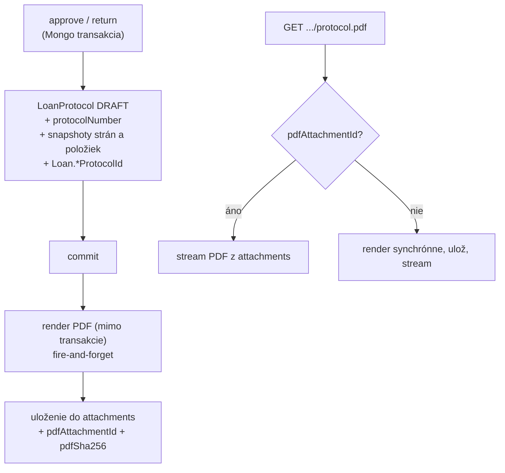

<!--
SPDX-FileCopyrightText: 2026 Ján Letko / LTK Solutions
SPDX-License-Identifier: CC-BY-4.0
-->

# 0022. Preberacie protokoly — model životného cyklu, PDF generovanie a podpisy

|                   |                                                                                                                                                                                                                                                                                                                                                  |
| ----------------- | ------------------------------------------------------------------------------------------------------------------------------------------------------------------------------------------------------------------------------------------------------------------------------------------------------------------------------------------------ |
| **Status**        | Proposed                                                                                                                                                                                                                                                                                                                                         |
| **Dátum**         | 2026-05-31                                                                                                                                                                                                                                                                                                                                       |
| **Autori**        | Ján Letko, Claude Opus 4.8 (LTK Solutions)                                                                                                                                                                                                                                                                                                       |
| **Súvisiace ADR** | [0012 Loans state machine](0012-loans-state-machine.md) (odložil PDF protokoly na #5b — toto ADR ich rozhoduje), [0010 Multi-tenant white-label](0010-multi-tenant-white-label.md), [0005 Mongo native driver](0005-mongo-native-driver.md), [0021 QR kódy majetku](0021-asset-qr-codes.md), [0011 EUPL licensing](0011-licensing-eupl-reuse.md) |

## Kontext

Preberací protokol je **právne relevantný dokument** o fyzickom odovzdaní (HANDOVER)
alebo vrátení (RETURN) majetku — „kto, čo, kedy, v akom stave, podpis oboch strán".
Pre cieľové segmenty (mestá, VÚC, zväzy, školy) je papierový/PDF protokol často
**formálnou požiadavkou** evidencie, nie nice-to-have. ADR-0012 to predvídal a
[`LoanProtocolSchema`](../../packages/shared-types/src/schemas/loan-protocol.ts)
existuje v `shared-types` od slice #1, ale Slice #5 MVP ho vedome **odložil**:
žiadne `LoanProtocol` dokumenty sa zatiaľ nevytvárajú a `Loan.handoverProtocolId` /
`Loan.returnProtocolId` ostávajú vždy `null`. Toto ADR rozhoduje, ako sa táto
medzera uzavrie.

Treba rozhodnúť **štyri veci**:

1. **Kedy v životnom cykle vzniká protokol** — čo je „záznam" a čo je „PDF", a kedy
   ktoré vzniká vzhľadom na existujúce transakcie approve/return.
2. **Akou technológiou sa PDF renderuje** v Node/Fastify prostredí nasadenom na Verceli.
3. **Ako sa rieši slovenská diakritika** v PDF.
4. **Ako sa rieši white-label** (logo a identita tenanta) a **kde je PDF uložené**.

### Obmedzenia

- **Existujúca schéma je zdroj pravdy.** `LoanProtocolSchema` už definuje finálny tvar:
  `type` (HANDOVER/RETURN/AMENDMENT), `protocolNumber` (`PROT-YYYY-NNNNNN`), `parties`
  (handover/receive so snapshotmi), `items` (so stavom a fotkami), `signatures`
  (handover/receive, metóda, IP, `signatureImageId`), `pdfAttachmentId`, `pdfSha256`,
  `status` (DRAFT/SIGNED/AMENDED/VOIDED). **Toto ADR schému nemení** — len rozhoduje,
  ako sa napĺňa a renderuje. Akákoľvek zmena ide cez Zod (Zod → TS → JSON Schema →
  Mongo `$jsonSchema` → OpenAPI).
- **`LoanProtocolSchema` nemá `organisationId`.** Rovnaký multi-tenant bug ako mal
  `Loan`/`LoanRequest` pred Slice #5 K1 ([ADR-0012](0012-loans-state-machine.md)). Treba
  doplniť `OrganisationScopedSchema` merge — porušuje [ADR-0010](0010-multi-tenant-white-label.md).
- **Nasadenie na Verceli (serverless).** Tvrdé limity na veľkosť funkcie a cold-start.
  Headless Chromium (~300 MB) je tu reálny problém — viď rozhodnutie 2.
- **Slovenčina.** Dokument je v slovenčine (`ľ š č ť ž ý á í é ä ô ...`). Štandardné
  PDF (WinAnsi) fonty diakritiku nepokrývajú — toto musí byť explicitné rozhodnutie,
  nie objavená chyba pri implementácii.
- **Transakcie musia ostať rýchle.** Mongo transakcie v approve/return menia viacero
  dokumentov cez 3–4 kolekcie ([ADR-0012](0012-loans-state-machine.md)). Ťažké
  renderovanie PDF **nesmie** byť vnútri transakcie.
- **Multi-tenancy a forky ([ADR-0010](0010-multi-tenant-white-label.md)).** Logo a
  identita v hlavičke protokolu sú per-tenant. Zdroj loga je `Organisation.brandKit.logoUrl`
  (default null → Inventario default). Nikdy nehardkódovať.
- **Integrita.** Protokol je po podpise **nemenný**; zmeny idú formou dodatku (AMENDMENT
  s `originalProtocolId`). `pdfSha256` slúži ako dôkaz integrity.
- **Solo dev pred pilotom** — reálne riziko over-engineeringu (kvalifikované e-podpisy
  eIDAS, biometria, archivačné politiky) skôr, než existuje reálny tenant a feedback.

## Možnosti

### 1. Kedy vzniká protokol (záznam vs. PDF)

#### Možnosť A: Záznam + PDF synchrónne v transakcii approve/return

Pri schválení/vrátení sa v tej istej Mongo transakcii vytvorí `LoanProtocol` aj
vyrenderuje a uloží PDF.

- Plus: protokol (vrátane PDF) vždy existuje hneď po prechode.
- Mínus: ťažký render (font embedding, logo fetch, layout) **vnútri** transakcie =
  dlhá transakcia, vyššia šanca na write-conflict/abort; sieťový fetch loga v transakcii
  je anti-pattern; zlyhanie renderu by zhodilo celý approve/return.

#### Možnosť B: Žiadny záznam, PDF čisto on-demand

Pri approve/return sa nestane nič navyše. PDF sa generuje deterministicky až pri
stiahnutí, žiadny `LoanProtocol` dokument neexistuje.

- Plus: najjednoduchšie, žiadna perzistencia.
- Mínus: **stráca sa právny záznam** — neexistuje nemenný dokument s `protocolNumber`,
  podpismi a `pdfSha256` zachytený v momente odovzdania; podpisy nemajú kam ísť; číslo
  protokolu by sa muselo počítať za behu (nestabilné). Pre právny dokument neprijateľné.

#### Možnosť C: Záznam v transakcii, PDF on-demand (zvolené)

Pri approve/return sa v transakcii vytvorí `LoanProtocol` dokument so `status: DRAFT`,
prideleným `protocolNumber` a snapshotmi strán a položiek. PDF (a `pdfSha256`) sa
renderuje **mimo transakcie** — buď fire-and-forget hneď po commite, alebo lazy pri
prvom stiahnutí; `pdfAttachmentId` sa doplní po vyrenderovaní.

- Plus: záznam je právne ukotvený v momente odovzdania (číslo, strany, stav položiek),
  transakcia ostáva rýchla a bez sieťových volaní; presne na toto je schéma navrhnutá
  (`status: DRAFT`, `pdfAttachmentId` nullable, `pdfSha256` nullable).
- Mínus: dvojfázovosť (záznam vznikne, PDF chvíľu „nie je") — treba ošetriť stav, keď
  je `pdfAttachmentId === null` (regenerovať on-demand).

### 2. PDF rendering technológia

#### Možnosť A: `pdf-lib` (zvolené)

Čisté JS/TS, programatický layout (kreslenie textu, čiar, tabuliek, embedovanie obrázkov).

- Plus: žiadny binárny závis, malá veľkosť, funguje v serverless bez problémov; deterministický
  výstup → stabilný `pdfSha256`; embedovanie loga (`embedPng`/`embedJpg`) aj TTF fontu
  (cez `@pdf-lib/fontkit`) priamočiare.
- Mínus: layout sa programuje ručne (súradnice, zalamovanie tabuľky) — pracnejšie pri
  zložitej grafike. Pre pevne štruktúrovaný právny formulár je to akceptovateľné.

#### Možnosť B: Puppeteer / Playwright (HTML → PDF)

Render HTML/CSS šablóny cez headless Chromium.

- Plus: krajší layout, CSS, jednoduché zalamovanie; HTML šablóna je čitateľnejšia než
  kreslenie po súradniciach; diakritika „zadarmo" cez webfonty.
- Mínus: **~300 MB Chromium** — na Verceli serverless funkcii problém (veľkosť, cold-start,
  `@sparticuz/chromium` hacky); ťažšie deterministický byte-output (verzie Chromia menia
  rendering → nestabilný hash); ťažší prevádzkový profil pre solo-hosted forky.

#### Možnosť C: `pdfmake` / `pdfkit`

Deklaratívny (pdfmake) alebo imperatívny (pdfkit) JS PDF builder.

- Plus: deklaratívne tabuľky (pdfmake) pohodlnejšie než holé `pdf-lib`.
- Mínus: ďalší závis s vlastným font-handlingom; `pdf-lib` je už zvolený štandard v
  ekosystéme projektu pre QR/štítky úvahy a má najmenší a najtransparentnejší footprint;
  netreba zavádzať druhý PDF stack.

### 3. Diakritika

#### Možnosť A: Štandardné PDF fonty (Helvetica/WinAnsi)

- Plus: nula závisov.
- Mínus: **nepodporuje slovenskú diakritiku** (`ľ š č ť ž ô ...` chýbajú) — neprijateľné.

#### Možnosť B: Embedovaný TTF/OTF font s plnou latin-ext sadou (zvolené)

Embednúť open-source font (napr. **DejaVu Sans** alebo **Noto Sans**, oboje licenčne
kompatibilné s EUPL/CC-BY projektom) cez `@pdf-lib/fontkit`.

- Plus: plná podpora SK diakritiky; font je súčasť repozitára → deterministický a
  offline render.
- Mínus: font subset zväčší PDF (mitigovateľné subsettingom); jeden závis navyše
  (`@pdf-lib/fontkit`).

### 4. Úložisko PDF + white-label

Schéma už hovorí, že PDF ide do `attachments` collection a `LoanProtocol` drží len
metadata + `pdfAttachmentId`. Attachments infra ([ADR-0012] ju označil ako „nie v MVP")
je teda **predpoklad** tohto ADR — viď rozhodnutie 5. Logo do hlavičky sa berie z
`Organisation.brandKit.logoUrl` (alebo Inventario default, ak null).

## Rozhodnutie

### 1. Životný cyklus: záznam v transakcii, PDF on-demand (Možnosť C)

- **Pri approve** (HANDOVER) a **pri return** (RETURN) sa **v rovnakej transakcii** ako
  doteraz vytvorí `LoanProtocol` dokument:
  - `status: 'DRAFT'`,
  - pridelený `protocolNumber` (viď rozhodnutie 6),
  - `parties` a `items` ako **snapshoty** (meno, email, org. jednotka, inv. číslo, názov,
    sériové číslo, kategória, stav) — protokol je nemenný, takže nesmie závisieť na
    neskorších zmenách asset/user dokumentov,
  - `pdfAttachmentId: null`, `pdfSha256: null`, `signatures: { handover: null, receive: null }`.
  - `Loan.handoverProtocolId` / `Loan.returnProtocolId` sa nastaví v tej istej transakcii.
- **PDF sa renderuje mimo transakcie.** Po commite sa zavolá render; výsledné PDF sa uloží
  do attachments a `pdfAttachmentId` + `pdfSha256` sa doplnia na protokol (`status` ostáva
  `DRAFT`, kým nie je podpísaný — viď rozhodnutie 7).
- **Lazy fallback:** endpoint na stiahnutie PDF vždy skontroluje `pdfAttachmentId`; ak je
  `null` (render zlyhal/ešte nebežal), vyrenderuje a uloží synchrónne pri requeste. PDF je
  čistá funkcia záznamu, takže regenerácia dá ten istý obsah (a ten istý hash).

### 2. PDF cez `pdf-lib` + `@pdf-lib/fontkit` (Možnosť A)

`pdf-lib` je zvolený renderer. Dôvod: serverless-friendly (žiadny Chromium), deterministický
byte-output (stabilný `pdfSha256`), priamočiare embedovanie loga a fontu. Layout protokolu
sa implementuje ako parametrická funkcia `renderProtocolPdf(protocol, organisation, font, logo)`
vracajúca `Uint8Array`.

### 3. Embedovaný TTF font (Možnosť B)

Do repozitára pribudne open-source font s plnou latin-ext sadou (**DejaVu Sans** alebo
**Noto Sans** — finálny výber pri implementácii, podľa licencie a veľkosti subsetu),
embedovaný cez `@pdf-lib/fontkit`. Žiadne WinAnsi štandardné fonty pre telo dokumentu.
Font subset je zapnutý kvôli veľkosti PDF.

### 4. Determinizmus a `pdfSha256`

PDF render musí byť **deterministický**, aby `pdfSha256` bol stabilný (rovnaký vstup →
rovnaké bajty → rovnaký hash):

- žiadne `now()` vnútri renderu — všetky dátumy sa berú zo záznamu (`issuedAt`, podpisy),
- `pdf-lib` `CreationDate`/`ModDate` sa nastaví **explicitne** na `issuedAt`, nie na čas
  renderu (inak by každý render dal iný hash),
- font a logo sú fixné vstupy.

`pdfSha256` sa počíta nad výsledným bajtovým poľom a ukladá na protokol ako dôkaz integrity.

### 5. Úložisko: `attachments` collection (predpoklad — attachments infra)

PDF sa ukladá ako attachment; `LoanProtocol.pdfAttachmentId` naň referuje. To znamená, že
**attachments infra je predpoklad** tohto ADR (`AttachmentSchema` v shared-types existuje;
repository/service/storage backend treba). Rozhodnutie o storage backende (GridFS vs. externý
blob/S3-kompatibilný) je **mimo rozsah tohto ADR** a rieši ho samostatné rozhodnutie o
attachments (kandidát na ADR-0023). Pre prvú fázu je akceptovateľný aj GridFS na Atlase.

White-label logo: z `Organisation.brandKit.logoUrl`; ak `null`, použije sa Inventario default
([`docs/assets/brand/inventario/logo.svg`](../assets/brand/inventario/) → rasterizovaný PNG
pre `pdf-lib`, ktorý SVG natívne neembeduje). Identita v hlavičke: `Organisation.displayName`

- (ak vyplnené) `billing.legalName`, `ico`, `dic` z [`OrganisationBillingSchema`](../../packages/shared-types/src/schemas/organisation.ts).

### 6. `protocolNumber` — formát a generovanie

Formát je už v schéme: `PROT-YYYY-NNNNNN` (regex `^PROT-\d{4}-\d{6}$`).

- **Per tenant + per rok**, zero-padded na 6 cifier, **transakčne** generované rovnakým
  princípom ako `inventoryNumber` (server-side, atomické, žiadne medzery garantované len
  v rámci normálnej prevádzky).
- Poradové počítadlo je **scoped na `organisationId` + rok** vystavenia. (Konzistentné s
  parametrickým `inventoryNumberFormat` z [ADR-0021](0021-asset-qr-codes.md), ale protokol
  má **fixný** formát — nie je per-tenant konfigurovateľný, lebo `PROT-` prefix je
  vynútený regexom schémy. Prípadná konfigurovateľnosť je mimo rozsah.)
- Číslo sa prideľuje v tej istej transakcii ako vznik `LoanProtocol` (rozhodnutie 1), aby
  nevznikli dva protokoly s rovnakým číslom.

### 7. Podpisy — MVP rozsah: CLICK_TO_SIGN

Schéma podporuje `BIOMETRIC | CLICK_TO_SIGN | EXTERNAL`. Pre prvú fázu **iba `CLICK_TO_SIGN`**:

- po vyrenderovaní DRAFT PDF obe strany potvrdia („klik-to-sign") → zapíše sa
  `signatures.handover` / `signatures.receive` (`signedAt`, `method: CLICK_TO_SIGN`,
  `ipAddress`, `signatureImageId: null`),
- keď sú **obe** strany podpísané, protokol prejde `DRAFT → SIGNED` a PDF sa **re-renderuje**
  s vyznačenými podpismi (nový `pdfSha256`); od toho momentu je **nemenný**.
- `BIOMETRIC` (podpis prstom na dotykovom displeji → `signatureImageId`) a `EXTERNAL`
  (kvalifikovaný e-podpis / eIDAS) sú **mimo rozsah** prvej fázy.

> **Pozn.:** „SIGNED" tu znamená preukázateľný súhlasový záznam (čas, IP, identita prihláseného
> používateľa), **nie** kvalifikovaný elektronický podpis v zmysle eIDAS. Pre právnu váhu
> postačuje pre interné preberacie protokoly väčšiny tenantov; tenant s požiadavkou na QES
> potrebuje `EXTERNAL` (neskoršia fáza).

### 8. AMENDMENT (dodatok)

Po `SIGNED` je protokol nemenný. Oprava = **nový** `LoanProtocol` `type: AMENDMENT` s
`originalProtocolId` ukazujúcim na pôvodný; pôvodný prejde `SIGNED → AMENDED`. VOIDED slúži
na anulovanie bez zmeny obsahu. Plný amendment flow (UI, dôvod, re-sign) je v rozsahu, ale
**až po** HANDOVER/RETURN happy-path — viď fázovanie.

### 9. Schema fix — `organisationId` na `LoanProtocolSchema`

Pred implementáciou doplniť `OrganisationScopedSchema` merge do `LoanProtocolSchema`
(rovnako ako Slice #5 K1 spravil pre `Loan`/`LoanRequest`). Bez toho protokol porušuje
[ADR-0010](0010-multi-tenant-white-label.md). Regen JSON Schema + OpenAPI.

### Endpoint inventory (návrh)

| Method | Path                             | Telo / výstup                   | Roly                               |
| ------ | -------------------------------- | ------------------------------- | ---------------------------------- |
| `GET`  | `/v1/loans/:id/protocols`        | zoznam protokolov k zápožičke   | borrower ALEBO ASSET_MANAGER+ADMIN |
| `GET`  | `/v1/protocols/:protocolId`      | metadata protokolu (JSON)       | účastník ALEBO ASSET_MANAGER+ADMIN |
| `GET`  | `/v1/protocols/:protocolId/pdf`  | `application/pdf` (lazy render) | účastník ALEBO ASSET_MANAGER+ADMIN |
| `POST` | `/v1/protocols/:protocolId/sign` | `{ method: 'CLICK_TO_SIGN' }`   | príslušná strana protokolu         |

Samotné **vytvorenie** protokolu nemá vlastný endpoint — vzniká ako side-effect approve/return
(rozhodnutie 1). Stiahnutie PDF je idempotentné a cacheovateľné (po SIGNED je obsah nemenný).

## Dôsledky

### Pozitívne

- Právny záznam je ukotvený v momente odovzdania (číslo, strany, stav položiek, podpisy),
  bez spomalenia kritickej approve/return transakcie.
- `pdf-lib` + embedovaný font = serverless-friendly, deterministický, plná SK diakritika,
  bez Chromium footprintu na Verceli aj v solo-hosted forkoch.
- White-label hlavička z `brandKit.logoUrl` + billing identity → protokol vyzerá ako dokument
  tenanta, nie Inventaria; default fallback ostáva čistý.
- Deterministický render → `pdfSha256` je zmysluplný dôkaz integrity; nemennosť po SIGNED +
  AMENDMENT flow zodpovedajú už existujúcej schéme bez jej zmeny.
- Napĺňa `Loan.handoverProtocolId` / `returnProtocolId`, ktoré ADR-0012 nechal `null` —
  uzatvára vedome odloženú medzeru #5b.

### Negatívne / kompromisy

- **Závislosť na attachments infra**, ktorá ešte nie je hotová — toto ADR ju robí
  predpokladom a deleguje rozhodnutie o storage backende na samostatné ADR (kandidát 0023).
  Bez attachments sa PDF nemá kam uložiť (zmiernené lazy on-demand renderom, ale streamovať
  treba aj tak).
- **Ručný layout v `pdf-lib`** (súradnice, zalamovanie tabuľky položiek pri 25+ položkách,
  stránkovanie) je pracnejší než HTML/CSS šablóna; treba ošetriť pretečenie na ďalšiu stranu.
- **CLICK_TO_SIGN nie je QES.** Pre tenanta s požiadavkou na kvalifikovaný podpis (eIDAS)
  prvá fáza nestačí — `EXTERNAL` je neskôr.
- **Re-render po podpise** mení `pdfSha256` — treba jasne komunikovať, že hash DRAFT a hash
  SIGNED sa líšia (hash sa viaže na konkrétnu verziu; SIGNED verzia je tá záväzná).

### Riziká, ktoré treba sledovať

- **Determinizmus renderu.** Ak sa do PDF dostane `now()` (CreationDate/ModDate, „vygenerované
  dňa"), hash bude pri každom renderi iný a `pdfSha256` stratí zmysel. Mitigácia: všetky časy
  zo záznamu, explicitné metadata dátumy = `issuedAt`, test ktorý dvakrát vyrenderuje ten istý
  protokol a porovná bajty/hash.
- **Snapshot vs. živé dáta.** Ak by sa protokol renderoval zo _živých_ asset/user dokumentov
  namiesto zo snapshotov v zázname, neskoršia zmena (premenovaný asset, zmenené meno) by ticho
  prepísala „históriu". Mitigácia: render číta **výhradne** zo snapshotov v `LoanProtocol`.
- **Race na `protocolNumber`.** Dva súbežné approve v rovnakom tenante/roku. Mitigácia:
  atomický counter v transakcii (rovnaký pattern ako `inventoryNumber`), unique index na
  `(organisationId, protocolNumber)`.
- **Veľkosť funkcie / font.** Embedovaný font + logo zväčšujú bundle. Mitigácia: font subset,
  logo ako rozumne veľký PNG; sledovať Vercel function size limit.
- **Logo z `brandKit.logoUrl` je externá URL.** Fetch loga pri renderi je sieťové volanie —
  nesmie byť v transakcii (nie je, render je mimo nej); ošetriť timeout a fallback na default
  logo pri nedostupnosti; zvážiť cache rasterizovaného loga.
- **SVG logo.** `pdf-lib` neembeduje SVG. Inventario default aj tenant logá v SVG treba
  rasterizovať na PNG (build-time pre default, on-the-fly/cache pre tenant). Pridať do
  implementačných poznámok.
- **GDPR/DPIA.** Protokol obsahuje osobné údaje (meno, email, podpis, IP). Patrí do GDPR
  Article 30 inventára a retenčnej/pseudonymizačnej politiky (Phase D) — `ipAddress` a
  podpisové artefakty zahrnúť do retenčného plánu; zvážiť, či IP je nevyhnutná.

## Fázovanie

### Fáza 1 — HANDOVER + RETURN happy-path (po pilote / podľa potreby)

- **K1** — schema fix: `OrganisationScopedSchema` merge do `LoanProtocolSchema`; regen
  JSON Schema + OpenAPI. (Haiku)
- **K2** — embedovaný font do repo + `@pdf-lib/fontkit`; default logo rasterizácia (SVG→PNG);
  `renderProtocolPdf()` deterministický renderer (telo, tabuľka položiek, stránkovanie,
  hlavička s logom/identitou, pätka s podpismi). (Sonnet)
- **K3** — `protocolNumber` transakčný generátor (`PROT-YYYY-NNNNNN`, scoped org+rok, unique
  index). (Sonnet)
- **K4** — `LoanProtocolsRepository` + service: vznik DRAFT protokolu v approve/return
  transakcii (úprava `loans.service.ts`), nastavenie `Loan.*ProtocolId`, post-commit render
  - uloženie `pdfAttachmentId`/`pdfSha256`. (Sonnet)
- **K5** — routes: `GET /v1/loans/:id/protocols`, `GET /v1/protocols/:id`,
  `GET /v1/protocols/:id/pdf` (lazy render), RBAC. (Sonnet)
- **K6** — `POST /v1/protocols/:id/sign` (CLICK_TO_SIGN), prechod `DRAFT → SIGNED` keď obe
  strany, re-render. (Sonnet)
- **K7** — testy: determinizmus renderu (rovnaký vstup → rovnaký hash), diakritika,
  číslovanie + race, RBAC, cross-tenant izolácia, snapshot-not-live, stránkovanie pri 25+
  položkách. (Sonnet)
- **K8** — milestone doc + session log. (Haiku)

> **Predpoklad:** attachments infra (úložisko + repo/service) — buď samostatné ADR-0023
> pred K4, alebo minimálna GridFS implementácia v rámci K4.

### Fáza 2 — podľa reálnej potreby

- AMENDMENT flow (dôvod, re-sign, `originalProtocolId`, VOIDED) s UI.
- `BIOMETRIC` podpis (canvas → `signatureImageId`).
- `EXTERNAL` / QES (eIDAS) integrácia pre tenantov s právnou požiadavkou.
- Konfigurovateľná šablóna protokolu (logo pozícia, doplnkové právne klauzuly per tenant).
- Hromadná tlač / batch export protokolov.

## Referencie

- [ADR-0012 Loans state machine + Slice #5 MVP](0012-loans-state-machine.md) — odložil PDF protokoly na #5b; toto ADR ich rozhoduje
- [ADR-0010 Multi-tenant white-label](0010-multi-tenant-white-label.md) — `organisationId` invariant, white-label logo z `brandKit`
- [ADR-0005 Mongo native driver + Repository pattern](0005-mongo-native-driver.md) — `LoanProtocolsRepository` cez OrganisationScopedRepository, transakčný pattern
- [ADR-0021 QR kódy majetku](0021-asset-qr-codes.md) — paralela pre per-tenant číslovanie a on-demand generovanie artefaktu
- [packages/shared-types/src/schemas/loan-protocol.ts](../../packages/shared-types/src/schemas/loan-protocol.ts) — existujúca schéma protokolu (zdroj pravdy, nemení sa; doplní sa `organisationId`)
- [packages/shared-types/src/schemas/loan.ts](../../packages/shared-types/src/schemas/loan.ts) — `Loan.handoverProtocolId` / `returnProtocolId`
- [packages/shared-types/src/schemas/organisation.ts](../../packages/shared-types/src/schemas/organisation.ts) — `brandKit.logoUrl`, `displayName`, `billing` identity pre hlavičku
- [apps/api/src/modules/loans/loans.service.ts](../../apps/api/src/modules/loans/loans.service.ts) — miesto, kde sa DRAFT protokol vytvorí v approve/return transakcii
- [Phase D — GDPR Article 30](../milestones/phase-d-eu-compliance.md) — protokol obsahuje osobné údaje, retencia/pseudonymizácia
