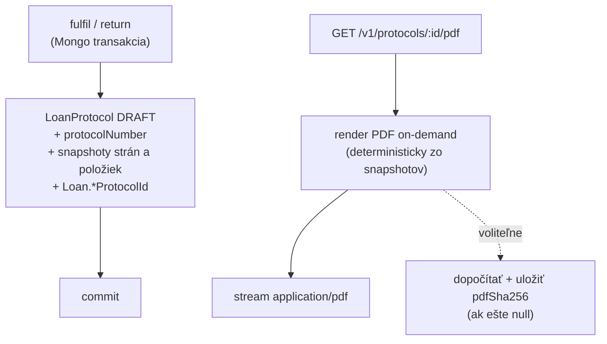

<!--
SPDX-FileCopyrightText: 2026 Ján Letko / LTK Solutions
SPDX-License-Identifier: CC-BY-4.0
-->

# 0022. Preberacie protokoly — model životného cyklu, on-demand PDF a podpisy

|                   |                                                                                                                                                                                                                                                                                                                                                                                                        |
| ----------------- | ------------------------------------------------------------------------------------------------------------------------------------------------------------------------------------------------------------------------------------------------------------------------------------------------------------------------------------------------------------------------------------------------------ |
| **Status**        | ✅ Accepted                                                                                                                                                                                                                                                                                                                                                                                            |
| **Dátum**         | 2026-05-31 (pôvodný návrh) · **revidované 2026-06-01** (PDF bez ukladania + zosúladenie s ADR-0026)                                                                                                                                                                                                                                                                                                    |
| **Autori**        | Ján Letko, Claude Opus 4.8 (LTK Solutions)                                                                                                                                                                                                                                                                                                                                                             |
| **Súvisiace ADR** | [0012 Loans state machine](0012-loans-state-machine.md), [0026 Katalógové žiadosti + vydávanie](0026-catalog-requests-and-fulfilment.md) (mení, kedy protokol vzniká), [0010 Multi-tenant white-label](0010-multi-tenant-white-label.md), [0005 Mongo native driver](0005-mongo-native-driver.md), [0021 QR kódy majetku](0021-asset-qr-codes.md), [0011 EUPL licensing](0011-licensing-eupl-reuse.md) |

## Kontext

Preberací protokol je **právne relevantný dokument** o fyzickom odovzdaní (HANDOVER)
alebo vrátení (RETURN) majetku — „kto, čo, kedy, v akom stave, podpis oboch strán".
Pre cieľové segmenty (mestá, VÚC, zväzy, školy) je papierový/PDF protokol často
**formálnou požiadavkou** evidencie, nie nice-to-have. ADR-0012 to predvídal a
[`LoanProtocolSchema`](../../packages/shared-types/src/schemas/loan-protocol.ts)
existuje v `shared-types` od slice #1, ale Slice #5 MVP ho vedome **odložil**:
žiadne `LoanProtocol` dokumenty sa zatiaľ nevytvárajú a `Loan.handoverProtocolId` /
`Loan.returnProtocolId` ostávajú vždy `null`. Toto ADR rozhoduje, ako sa táto
medzera uzavrie.

> **Revízia 2026-06-01.** Pôvodný návrh (2026-05-31) predpokladal, že PDF sa renderuje
> a **ukladá** do `attachments` collection (`pdfAttachmentId`), čo robilo attachments
> infra predpokladom tohto ADR. Po rozhodnutí _„neukladať nič, čo vieme deterministicky
> vygenerovať on-demand"_ sa model zjednodušuje: **PDF sa neukladá vôbec** — renderuje sa
> čisto on-demand pri stiahnutí. Záznam `LoanProtocol` (číslo, snapshoty, podpisy) zostáva
> ako právne ukotvenie, attachments infra **prestáva byť predpoklad**. Zároveň revízia
> zosúlaďuje _kedy_ protokol vzniká s [ADR-0026](0026-catalog-requests-and-fulfilment.md),
> ktorý medzičasom prepísal loans model (approve už nevydáva — Loan vzniká pri `fulfil`).

Treba rozhodnúť **päť vecí**:

1. **Kedy v životnom cykle vzniká protokol** — čo je „záznam" a kedy vzniká vzhľadom na
   loan transakcie (po ADR-0026: vydanie `fulfil` a vrátenie `return`).
2. **Či sa PDF ukladá, alebo generuje on-demand.**
3. **Akou technológiou sa PDF renderuje** v Node/Fastify prostredí nasadenom na Verceli.
4. **Ako sa rieši slovenská diakritika** v PDF.
5. **Ako sa rieši white-label** (logo a identita tenanta) a **čo znamená `pdfSha256`**
   bez ukladania.

### Obmedzenia

- **Existujúca schéma je zdroj pravdy.** `LoanProtocolSchema` už definuje finálny tvar:
  `type` (HANDOVER/RETURN/AMENDMENT), `protocolNumber` (`PROT-YYYY-NNNNNN`), `parties`
  (handover/receive so snapshotmi), `items` (so stavom a fotkami), `signatures`
  (handover/receive, metóda, IP, `signatureImageId`), `pdfSha256`, `status`
  (DRAFT/SIGNED/AMENDED/VOIDED). Schéma už má `OrganisationScopedSchema` merge
  (multi-tenant invariant splnený). Toto ADR schému **mení len v jednej veci** — viď
  rozhodnutie 5 (pole `pdfAttachmentId` sa odstráni ako nepotrebné). Akákoľvek zmena ide
  cez Zod (Zod → TS → JSON Schema → Mongo `$jsonSchema` → OpenAPI).
- **ADR-0026 prepísal loans model.** Žiadosť je katalógová (kategória + množstvo), approve
  **už nevytvára Loan** ani nevydáva. Loan vzniká až pri `POST /v1/loan-requests/:id/fulfil`
  (alebo pri priamej výpožičke `POST /v1/loans`, ADR-0023). HANDOVER protokol preto patrí
  k **vydaniu** (`fulfil` / direct loan), nie k approve. RETURN patrí k `return`.
- **Nasadenie na Verceli (serverless).** Tvrdé limity na veľkosť funkcie a cold-start.
  Headless Chromium (~300 MB) je tu reálny problém — viď rozhodnutie 3.
- **Slovenčina.** Dokument je v slovenčine (`ľ š č ť ž ý á í é ä ô ...`). Štandardné
  PDF (WinAnsi) fonty diakritiku nepokrývajú — toto musí byť explicitné rozhodnutie,
  nie objavená chyba pri implementácii.
- **Loan transakcie musia ostať rýchle.** Mongo transakcie vo `fulfil`/`return` menia
  viacero dokumentov cez 3–4 kolekcie. Ťažké renderovanie PDF **nesmie** byť vnútri
  transakcie.
- **Multi-tenancy a forky ([ADR-0010](0010-multi-tenant-white-label.md)).** Logo a
  identita v hlavičke protokolu sú per-tenant. Zdroj loga je `Organisation.brandKit.logoUrl`
  (default null → Inventario default). Nikdy nehardkódovať.
- **Integrita.** Protokol je po podpise **nemenný**; zmeny idú formou dodatku (AMENDMENT
  s `originalProtocolId`). `pdfSha256` slúži ako dôkaz integrity.
- **Minimalizácia úložiska.** Nič, čo vieme deterministicky vygenerovať zo záznamu, sa
  neukladá. PDF je čistá funkcia záznamu → patrí medzi generované, nie uložené artefakty
  (rovnaký princíp ako QR kódy v [ADR-0021](0021-asset-qr-codes.md)).
- **Solo dev pred pilotom** — reálne riziko over-engineeringu (kvalifikované e-podpisy
  eIDAS, biometria, archivačné politiky, blob storage) skôr, než existuje reálny tenant
  a feedback.

## Možnosti

### 1. Kedy vzniká protokol (záznam) a či sa PDF ukladá

#### Možnosť A: Záznam + PDF synchrónne v transakcii, PDF uložené

Pri vydaní/vrátení sa v tej istej Mongo transakcii vytvorí `LoanProtocol`, vyrenderuje
a uloží PDF do attachments.

- Plus: protokol (vrátane PDF) vždy existuje hneď po prechode.
- Mínus: ťažký render (font embedding, logo fetch, layout) **vnútri** transakcie =
  dlhá transakcia, vyššia šanca na write-conflict/abort; sieťový fetch loga v transakcii
  je anti-pattern; zlyhanie renderu by zhodilo celý fulfil/return; **a navyše ukladá
  plne odvoditeľný artefakt** (PDF), čo porušuje minimalizáciu úložiska.

#### Možnosť B: Žiadny záznam, PDF aj číslo čisto on-demand

Pri vydaní/vrátení sa nestane nič navyše. PDF aj `protocolNumber` sa počítajú za behu
pri stiahnutí, žiadny `LoanProtocol` dokument neexistuje.

- Plus: najjednoduchšie, žiadna perzistencia.
- Mínus: **stráca sa právny záznam** — neexistuje nemenný dokument s `protocolNumber`,
  podpismi a snapshotmi zachytený v momente odovzdania; podpisy nemajú kam ísť; číslo
  protokolu počítané za behu je nestabilné (nemá kde „bývať"). Pre právny dokument
  neprijateľné.

#### Možnosť C: Záznam v transakcii, PDF čisto on-demand bez ukladania (zvolené)

Pri vydaní (`fulfil` / direct loan) a vrátení (`return`) sa v transakcii vytvorí
`LoanProtocol` dokument so `status: DRAFT`, prideleným `protocolNumber` a snapshotmi
strán a položiek. **PDF sa neukladá nikde** — renderuje sa deterministicky až pri
každom stiahnutí zo záznamu. `pdfSha256` sa môže (voliteľne) vypočítať a uložiť ako
dôkaz integrity konkrétnej vyrenderovanej verzie, ale samotné bajty PDF sa nedržia.

- Plus: záznam je právne ukotvený v momente odovzdania (číslo, strany, stav položiek,
  podpisy), transakcia ostáva rýchla a bez sieťových volaní; **žiadna attachments infra
  nie je potrebná**; žiadny odvoditeľný artefakt v úložisku; presne na toto je schéma
  navrhnutá (`status: DRAFT`, `pdfSha256` nullable).
- Mínus: PDF sa renderuje pri každom stiahnutí (lacná operácia, cacheovateľná na CDN);
  determinizmus renderu je teraz **kritický** (inak by sa „ten istý" protokol stiahol
  zakaždým s iným hashom) — viď rozhodnutie 4.

### 2. PDF rendering technológia

#### Možnosť A: `pdf-lib` (zvolené)

Čisté JS/TS, programatický layout (kreslenie textu, čiar, tabuliek, embedovanie obrázkov).

- Plus: žiadny binárny závis, malá veľkosť, funguje v serverless bez problémov; deterministický
  výstup → stabilný `pdfSha256`; embedovanie loga (`embedPng`/`embedJpg`) aj TTF fontu
  (cez `@pdf-lib/fontkit`) priamočiare.
- Mínus: layout sa programuje ručne (súradnice, zalamovanie tabuľky) — pracnejšie pri
  zložitej grafike. Pre pevne štruktúrovaný právny formulár je to akceptovateľné.

#### Možnosť B: Puppeteer / Playwright (HTML → PDF)

Render HTML/CSS šablóny cez headless Chromium.

- Plus: krajší layout, CSS, jednoduché zalamovanie; diakritika „zadarmo" cez webfonty.
- Mínus: **~300 MB Chromium** — na Verceli serverless funkcii problém; ťažšie deterministický
  byte-output (verzie Chromia menia rendering → nestabilný hash); ťažší prevádzkový profil
  pre solo-hosted forky. Pri on-demand renderi (rozhodnutie 1C) je determinizmus o to
  dôležitejší — Chromium ho nezaručuje.

#### Možnosť C: `pdfmake` / `pdfkit`

- Plus: deklaratívne tabuľky (pdfmake) pohodlnejšie než holé `pdf-lib`.
- Mínus: ďalší závis s vlastným font-handlingom; `pdf-lib` je už zvolený štandard v
  ekosystéme projektu (QR/štítky úvahy) a má najmenší footprint; netreba druhý PDF stack.

### 3. Diakritika

#### Možnosť A: Štandardné PDF fonty (Helvetica/WinAnsi)

- Mínus: **nepodporuje slovenskú diakritiku** — neprijateľné.

#### Možnosť B: Embedovaný TTF/OTF font s plnou latin-ext sadou (zvolené)

Embednúť open-source font (**DejaVu Sans** alebo **Noto Sans**, licenčne kompatibilné
s EUPL/CC-BY projektom) cez `@pdf-lib/fontkit`.

- Plus: plná podpora SK diakritiky; font je súčasť repozitára → deterministický a
  offline render.
- Mínus: font subset zväčší PDF (mitigovateľné subsettingom); jeden závis navyše.

## Rozhodnutie

### 1. Životný cyklus: záznam v transakcii, PDF čisto on-demand bez ukladania (Možnosť C)

- **Pri vydaní** (HANDOVER — vzniká v transakcii `fulfil` v `loans.service.ts`, resp. pri
  priamej výpožičke `createDirectLoan`) a **pri vrátení** (RETURN — v transakcii `return`)
  sa **v rovnakej transakcii** vytvorí `LoanProtocol` dokument:
  - `status: 'DRAFT'`,
  - pridelený `protocolNumber` (viď rozhodnutie 6),
  - `parties` a `items` ako **snapshoty** (meno, email, org. jednotka, inv. číslo, názov,
    sériové číslo, kategória, stav) — protokol je nemenný, takže nesmie závisieť na
    neskorších zmenách asset/user dokumentov,
  - `pdfSha256: null`, `signatures: { handover: null, receive: null }`.
  - `Loan.handoverProtocolId` / `Loan.returnProtocolId` sa nastaví v tej istej transakcii.

  > **Pozn. k ADR-0026:** jedna katalógová žiadosť → N Loanov (postupné vydávanie). Každé
  > `fulfil` volanie vytvára **vlastný Loan** a teda **vlastný HANDOVER protokol**. Protokol
  > je viazaný na konkrétny Loan (`loanId`), nie na žiadosť.

- **PDF sa neukladá.** Endpoint `GET /v1/protocols/:id/pdf` vyrenderuje PDF **on-demand
  pri každom requeste** zo snapshotov v zázname a vráti ho ako `application/pdf`. Žiadny
  blob, žiadna attachments collection, žiadny `pdfAttachmentId`.

- **`pdfSha256` (voliteľné, lazy):** keďže render je deterministický (rozhodnutie 4), hash
  výsledného PDF je stabilný. Pri prvom stiahnutí (alebo pri podpise) sa môže `pdfSha256`
  dopočítať a uložiť na záznam ako dôkaz integrity — overenie „toto PDF zodpovedá podpísanému
  protokolu" sa robí porovnaním hashu, nie uchovaním bajtov. Ak `pdfSha256` je `null`, ešte
  nebol vypočítaný; to nie je chyba.

### 2. PDF cez `pdf-lib` + `@pdf-lib/fontkit` (Možnosť A)

`pdf-lib` je zvolený renderer. Serverless-friendly (žiadny Chromium), deterministický
byte-output (kritické pri on-demand renderi), priamočiare embedovanie loga a fontu.
Layout protokolu = parametrická funkcia `renderProtocolPdf(protocol, organisation, font, logo)`
vracajúca `Uint8Array`.

### 3. Embedovaný TTF font (Možnosť B)

Open-source font s plnou latin-ext sadou (**DejaVu Sans** alebo **Noto Sans** — finálny
výber pri implementácii podľa licencie a veľkosti subsetu), embedovaný cez `@pdf-lib/fontkit`.
Žiadne WinAnsi štandardné fonty pre telo dokumentu. Font subset zapnutý kvôli veľkosti.

### 4. Determinizmus renderu — teraz kritický

Keďže PDF sa **negeneruje raz a neukladá**, ale renderuje **pri každom stiahnutí**, render
musí byť **plne deterministický** — to isté PDF zakaždým:

- žiadne `now()` v renderi — všetky dátumy zo záznamu (`issuedAt`, podpisy),
- `pdf-lib` `CreationDate`/`ModDate` sa nastaví **explicitne** na `issuedAt`, nie na čas
  renderu (inak by každé stiahnutie dalo iný hash),
- font a logo sú fixné vstupy (logo cacheované — viď rozhodnutie 5),
- žiadne náhodné/iterované ID objektov závislé od času.

Test, ktorý dvakrát vyrenderuje ten istý protokol a porovná bajty/hash, je **povinný** —
je to invariant celého on-demand modelu, nie nice-to-have.

### 5. Schéma: odstrániť `pdfAttachmentId`; white-label hlavička

- **Odstrániť pole `pdfAttachmentId`** z `LoanProtocolSchema` — pri on-demand modeli nemá
  význam (PDF nemá attachment, na ktorý by referovalo). `pdfSha256` zostáva. Regen JSON
  Schema + OpenAPI. Keďže `LoanProtocol` sa zatiaľ nikde negeneruje (žiadne živé dáta),
  je to bezpečná čistá zmena bez migrácie.
- White-label logo: z `Organisation.brandKit.logoUrl`; ak `null`, Inventario default
  ([`docs/assets/brand/inventario/logo.svg`](../assets/brand/inventario/) → rasterizovaný
  PNG, `pdf-lib` neembeduje SVG). Identita v hlavičke: `Organisation.displayName`
  - (ak vyplnené) `billing.legalName`, `ico`, `dic` z
    [`OrganisationBillingSchema`](../../packages/shared-types/src/schemas/organisation.ts).
- Logo sa **cacheuje** (rasterizovaný PNG per tenant) — pri on-demand renderi by inak každé
  stiahnutie fetchovalo externú URL. Cache + fallback na default pri nedostupnosti.

### 6. `protocolNumber` — formát a generovanie

Formát je v schéme: `PROT-YYYY-NNNNNN` (regex `^PROT-\d{4}-\d{6}$`).

- **Per tenant + per rok**, zero-padded na 6 cifier, **transakčne** generované rovnakým
  princípom ako `inventoryNumber` (server-side, atomické).
- Poradové počítadlo **scoped na `organisationId` + rok** vystavenia. `PROT-` prefix je
  fixný (vynútený regexom schémy — nie je per-tenant konfigurovateľný, na rozdiel od
  `inventoryNumberFormat` z [ADR-0021](0021-asset-qr-codes.md)).
- Číslo sa prideľuje v tej istej transakcii ako vznik `LoanProtocol` (rozhodnutie 1).
- Unique index na `(organisationId, protocolNumber)`.

### 7. Podpisy — MVP rozsah: CLICK_TO_SIGN

Schéma podporuje `BIOMETRIC | CLICK_TO_SIGN | EXTERNAL`. Pre prvú fázu **iba `CLICK_TO_SIGN`**:

- obe strany potvrdia („klik-to-sign") → zapíše sa `signatures.handover` / `signatures.receive`
  (`signedAt`, `method: CLICK_TO_SIGN`, `ipAddress`, `signatureImageId: null`),
- keď sú **obe** strany podpísané, protokol prejde `DRAFT → SIGNED`. Od toho momentu je
  obsah záznamu **nemenný**; on-demand PDF odvtedy obsahuje vyznačené podpisy.
- `pdfSha256` sa (ak ešte null) dopočíta pri prechode na SIGNED — fixuje sa hash záväznej
  (podpísanej) verzie.
- `BIOMETRIC` (podpis prstom → `signatureImageId`) a `EXTERNAL` (eIDAS / QES) sú **mimo
  rozsah** prvej fázy.

> **Pozn.:** „SIGNED" tu znamená preukázateľný súhlasový záznam (čas, IP, identita prihláseného
> používateľa), **nie** kvalifikovaný elektronický podpis v zmysle eIDAS. Pre interné
> preberacie protokoly väčšiny tenantov postačuje; tenant s požiadavkou na QES potrebuje
> `EXTERNAL` (neskoršia fáza).

### 8. AMENDMENT (dodatok)

Po `SIGNED` je protokol nemenný. Oprava = **nový** `LoanProtocol` `type: AMENDMENT` s
`originalProtocolId` na pôvodný; pôvodný prejde `SIGNED → AMENDED`. VOIDED anuluje bez
zmeny obsahu. Plný amendment flow (UI, dôvod, re-sign) je v rozsahu, ale **až po**
HANDOVER/RETURN happy-path — viď fázovanie.

### Endpoint inventory (návrh)

| Method | Path                             | Telo / výstup                        | Roly                               |
| ------ | -------------------------------- | ------------------------------------ | ---------------------------------- |
| `GET`  | `/v1/loans/:id/protocols`        | zoznam protokolov k zápožičke (JSON) | borrower ALEBO ASSET_MANAGER+ADMIN |
| `GET`  | `/v1/protocols/:protocolId`      | metadata protokolu (JSON)            | účastník ALEBO ASSET_MANAGER+ADMIN |
| `GET`  | `/v1/protocols/:protocolId/pdf`  | `application/pdf` (on-demand render) | účastník ALEBO ASSET_MANAGER+ADMIN |
| `POST` | `/v1/protocols/:protocolId/sign` | `{ method: 'CLICK_TO_SIGN' }`        | príslušná strana protokolu         |

Samotné **vytvorenie** protokolu nemá vlastný endpoint — vzniká ako side-effect
`fulfil` / direct loan / `return` (rozhodnutie 1). Stiahnutie PDF je idempotentné a
cacheovateľné (po SIGNED je obsah nemenný, takže aj PDF bajty sú nemenné).

## Dôsledky

### Pozitívne

- Právny záznam je ukotvený v momente odovzdania (číslo, strany, stav položiek, podpisy),
  bez spomalenia kritickej `fulfil`/`return` transakcie.
- **Žiadna attachments infra nie je potrebná** — odpadá rozhodnutie o blob/GridFS storage,
  odpadá kandidátne ADR na attachments, odpadá ukladanie odvoditeľného artefaktu. Menší
  povrch, menej kódu, menej prevádzky.
- `pdf-lib` + embedovaný font = serverless-friendly, deterministický, plná SK diakritika,
  bez Chromium footprintu na Verceli aj v solo-hosted forkoch.
- White-label hlavička z `brandKit.logoUrl` + billing identity → protokol vyzerá ako dokument
  tenanta; default fallback ostáva čistý.
- Deterministický render → `pdfSha256` je zmysluplný dôkaz integrity aj bez uchovania bajtov;
  nemennosť po SIGNED + AMENDMENT flow zodpovedajú existujúcej schéme.
- Napĺňa `Loan.handoverProtocolId` / `returnProtocolId`, ktoré ADR-0012 nechal `null` —
  uzatvára vedome odloženú medzeru, zosúladené s ADR-0026 (protokol viazaný na Loan z `fulfil`).
- Rovnaký princíp ako QR kódy (ADR-0021): generuj on-demand, neukladaj odvoditeľné.

### Negatívne / kompromisy

- **Determinizmus renderu je teraz kritický invariant** (nie optimalizácia). Akýkoľvek
  `now()` alebo verz-závislé správanie v renderi rozbije stabilitu `pdfSha256`. Mitigácia:
  povinný test dvojitého renderu, explicitné metadata dátumy.
- **PDF sa renderuje pri každom stiahnutí** — vyššia CPU réžia než jednorazový render +
  cache bajtov. Pri očakávanom objeme (protokoly sa sťahujú zriedka, nie v hot-path) je to
  zanedbateľné; v prípade potreby CDN cache podľa `pdfSha256` ako ETag.
- **CLICK_TO_SIGN nie je QES.** Pre tenanta s požiadavkou na kvalifikovaný podpis (eIDAS)
  prvá fáza nestačí — `EXTERNAL` je neskôr.
- **Ručný layout v `pdf-lib`** (súradnice, zalamovanie tabuľky pri 25+ položkách,
  stránkovanie) je pracnejší než HTML/CSS šablóna.

### Riziká, ktoré treba sledovať

- **Determinizmus renderu.** Najvyššie riziko celého modelu — viď vyššie. Povinný
  byte-equality test.
- **Snapshot vs. živé dáta.** Render číta **výhradne** zo snapshotov v `LoanProtocol`, nikdy
  zo živých asset/user dokumentov — inak by neskoršia zmena ticho prepísala „históriu".
- **Race na `protocolNumber`.** Dva súbežné `fulfil` v rovnakom tenante/roku. Mitigácia:
  atomický counter v transakcii (ako `inventoryNumber`), unique index na
  `(organisationId, protocolNumber)`.
- **Logo z `brandKit.logoUrl` je externá URL.** Pri on-demand renderi by každé stiahnutie
  fetchovalo logo — preto **cache rasterizovaného loga** per tenant + fallback na default
  pri nedostupnosti/timeoute. Render je mimo transakcie, takže fetch nikdy neblokuje loan flow.
- **SVG logo.** `pdf-lib` neembeduje SVG → rasterizácia na PNG (build-time pre Inventario
  default, on-the-fly + cache pre tenant logá).
- **GDPR/DPIA.** Protokol obsahuje osobné údaje (meno, email, podpis, IP). Patrí do GDPR
  Article 30 inventára a retenčnej/pseudonymizačnej politiky (Phase D / Compliance Fáza 2) —
  `ipAddress` a podpisové artefakty zahrnúť do retenčného plánu; zvážiť, či IP je nevyhnutná.
  (Keďže PDF sa neukladá, perzistované osobné údaje sú len v `LoanProtocol` zázname — menší
  povrch na ochranu než pri uložených PDF blob-och.)

## Fázovanie

### Fáza 1 — HANDOVER + RETURN happy-path (po pilote / podľa potreby)

- **K1** — schema: **odstrániť `pdfAttachmentId`** z `LoanProtocolSchema`; regen JSON Schema
  - OpenAPI. (`organisationId` merge už existuje.) (Haiku)
- **K2** — embedovaný font do repo + `@pdf-lib/fontkit`; default logo rasterizácia (SVG→PNG);
  `renderProtocolPdf()` deterministický renderer (telo, tabuľka položiek, stránkovanie,
  hlavička s logom/identitou, pätka s podpismi). (Sonnet)
- **K3** — `protocolNumber` transakčný generátor (`PROT-YYYY-NNNNNN`, scoped org+rok, unique
  index). (Sonnet)
- **K4** — `LoanProtocolsRepository` + service: vznik DRAFT protokolu v transakcii **`fulfil`**
  (HANDOVER), **`createDirectLoan`** (HANDOVER), **`return`** (RETURN) v `loans.service.ts`;
  nastavenie `Loan.*ProtocolId`. (Sonnet)
- **K5** — routes: `GET /v1/loans/:id/protocols`, `GET /v1/protocols/:id`,
  `GET /v1/protocols/:id/pdf` (on-demand render, voliteľný lazy `pdfSha256`), RBAC. (Sonnet)
- **K6** — `POST /v1/protocols/:id/sign` (CLICK_TO_SIGN), prechod `DRAFT → SIGNED` keď obe
  strany, fixácia `pdfSha256`. (Sonnet)
- **K7** — testy: **determinizmus renderu (dvojitý render → rovnaký hash)**, diakritika,
  číslovanie + race, RBAC, cross-tenant izolácia, snapshot-not-live, stránkovanie pri 25+
  položkách, protokol per Loan pri viacnásobnom `fulfil` (ADR-0026). (Sonnet)
- **K8** — milestone doc + session log. (Haiku)

> **Žiadny predpoklad attachments infra.** Revízia 2026-06-01 túto závislosť odstránila.

### Fáza 2 — podľa reálnej potreby

- AMENDMENT flow (dôvod, re-sign, `originalProtocolId`, VOIDED) s UI.
- `BIOMETRIC` podpis (canvas → `signatureImageId`). **Pozn.:** podpisový obrázok je jediný
  artefakt, ktorý by sa musel ukladať (nie je odvoditeľný) — vtedy sa rieši minimálne
  úložisko pre `signatureImageId`, nie pre PDF.
- `EXTERNAL` / QES (eIDAS) integrácia pre tenantov s právnou požiadavkou.
- Konfigurovateľná šablóna protokolu (logo pozícia, doplnkové právne klauzuly per tenant).
- CDN cache PDF podľa `pdfSha256` (ETag) ak by objem stiahnutí narástol.

## Referencie

- [ADR-0012 Loans state machine + Slice #5 MVP](0012-loans-state-machine.md) — odložil PDF protokoly; toto ADR ich rozhoduje
- [ADR-0026 Katalógové žiadosti + vydávanie](0026-catalog-requests-and-fulfilment.md) — mení, kedy protokol vzniká (fulfil, nie approve); 1 žiadosť → N Loanov → N protokolov
- [ADR-0010 Multi-tenant white-label](0010-multi-tenant-white-label.md) — `organisationId` invariant, white-label logo z `brandKit`
- [ADR-0021 QR kódy majetku](0021-asset-qr-codes.md) — rovnaký princíp „generuj on-demand, neukladaj odvoditeľné"
- [ADR-0005 Mongo native driver + Repository pattern](0005-mongo-native-driver.md) — `LoanProtocolsRepository` cez OrganisationScopedRepository, transakčný pattern
- [packages/shared-types/src/schemas/loan-protocol.ts](../../packages/shared-types/src/schemas/loan-protocol.ts) — existujúca schéma (K1 odstráni `pdfAttachmentId`)
- [packages/shared-types/src/schemas/loan.ts](../../packages/shared-types/src/schemas/loan.ts) — `Loan.handoverProtocolId` / `returnProtocolId`
- [packages/shared-types/src/schemas/organisation.ts](../../packages/shared-types/src/schemas/organisation.ts) — `brandKit.logoUrl`, `displayName`, `billing` identity pre hlavičku
- [apps/api/src/modules/loans/loans.service.ts](../../apps/api/src/modules/loans/loans.service.ts) — miesto, kde DRAFT protokol vzniká v transakciách fulfil/return/createDirectLoan
- [Phase D — GDPR Article 30](../milestones/phase-d-eu-compliance.md) — protokol obsahuje osobné údaje, retencia/pseudonymizácia
