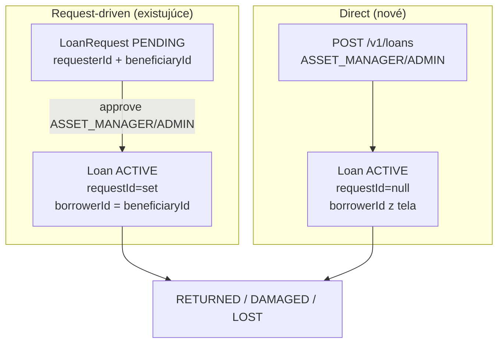

<!--
SPDX-FileCopyrightText: 2026 Ján Letko / LTK Solutions
SPDX-License-Identifier: CC-BY-4.0
-->

# 0023. Žiadosť v mene inej osoby + priama výpožička bez žiadosti

|                   |                                                                                                                                                                                                                                                                                                                                        |
| ----------------- | -------------------------------------------------------------------------------------------------------------------------------------------------------------------------------------------------------------------------------------------------------------------------------------------------------------------------------------- |
| **Status**        | ✅ Accepted (implementované 2026-05-31)                                                                                                                                                                                                                                                                                                |
| **Dátum**         | 2026-05-31                                                                                                                                                                                                                                                                                                                             |
| **Autori**        | Ján Letko, Claude Opus 4.8 (LTK Solutions)                                                                                                                                                                                                                                                                                             |
| **Súvisiace ADR** | [0012 Loans state machine](0012-loans-state-machine.md) (toto ADR upravuje jeho model — beneficiary + quick loan, ktorý #5 odložil ako US-017), [0022 Preberacie protokoly PDF](0022-loan-protocol-pdf.md), [0010 Multi-tenant white-label](0010-multi-tenant-white-label.md), [0005 Mongo native driver](0005-mongo-native-driver.md) |

> **Pozn. (2026-06-01):** [ADR-0026](0026-catalog-requests-and-fulfilment.md) nemení
> `beneficiaryId` ani priaču výpožičku — oba mechánizmy ostávajú bez zmeny.
> Pri katálogovéj žiadosti je `borrowerId` výsledného Loan-u = `beneficiaryId` žiadosti.

## Kontext

ADR-0012 postavil model zápožičiek na predpoklade, že **žiadateľ = vypožičiavajúci**:
`LoanRequest` má len `requesterId`, service ho tvrdo nastavuje na prihláseného používateľa
(`actorId`), a `Loan.borrowerId` sa odvodzuje z `requesterId`. Jediná cesta k vzniku `Loan`
je cez `approveLoanRequest` — `Loan.requestId` je **povinné** (`ObjectIdSchema`, nie nullable).

Spresnenie biznis modelu (2026-05-31) odhalilo dva nesúlady s realitou:

1. **Žiadosť býva podaná v mene inej osoby.** `LoanRequest` má byť všeobecná žiadosť
   „chcem vypožičať tento majetok" — a to buď pre seba, alebo pre niekoho iného (tréner
   žiada dresy pre hráča, asistent pre kolegu, koordinátor pre dobrovoľníka). Dnešný model
   to nedovoľuje: kto žiada, ten si aj požičiava.

2. **Výpožička môže vzniknúť aj bez žiadosti.** `Loan` vytvára správca majetku alebo admin
   (ASSET_MANAGER/ADMIN) — a **môže, ale nemusí** sa viazať na predchádzajúcu `LoanRequest`.
   Reálny scenár: osoba stojí fyzicky pri sklade/pulte, nepodávala žiadnu žiadosť, správca
   jej majetok rovno vydá a zaeviduje výpožičku. Dnešný model to nedovoľuje — `Loan` vzniká
   výlučne schválením žiadosti.

ADR-0012 druhý scenár predvídal ako **US-017 „quick loan"** a vedome ho odložil na #5b.
Toto ADR ho rozhoduje spolu s beneficiary modelom, lebo spolu definujú, čím `LoanRequest`
a `Loan` vlastne sú.

### Pojmové vymedzenie (po tomto ADR)

- **`LoanRequest` = žiadosť.** Všeobecný úmysel „chcem/chceme vypožičať". Podáva ju
  ktorýkoľvek používateľ (EMPLOYEE+), pre seba **alebo pre inú osobu**. Sama o sebe
  nevydáva majetok — len rezervuje a čaká na rozhodnutie správcu.
- **`Loan` = výpožička.** Skutočné odovzdanie majetku do držby. Vzniká **vždy** akciou
  správcu/admina (ASSET_MANAGER/ADMIN) — buď schválením žiadosti, alebo priamo. Nesie
  identitu reálneho vypožičiavajúceho (`borrowerId`) bez ohľadu na to, či bola žiadosť.

### Obmedzenia

- **Schémy sú zdroj pravdy** (Zod → TS → JSON Schema → Mongo `$jsonSchema` → OpenAPI).
  Zmena ide cez Zod, regen JSON Schema + OpenAPI.
- **Forward-compatibilita.** ADR-0012 nechal schémy zámerne bohaté a MVP ignoroval polia,
  ktoré nepotreboval. Pridanie `beneficiaryId` a nullovanie `requestId` musí ostať
  spätne kompatibilné s existujúcimi dátami (ak nejaké pilotné vzniknú).
- **Audit + GDPR.** Beneficiary aj direct-loan toky musia logovať prechody so správnymi
  Article 30 metadata (`dataCategories: ['workforce_management']`, `legalBasis`), rovnako
  ako existujúce akcie ([ADR-0012](0012-loans-state-machine.md)).
- **Asset state machine ostáva.** `AVAILABLE → RESERVED → BORROWED → AVAILABLE/IN_SERVICE/LOST`
  sa nemení; direct loan ju len vstupuje na inom mieste (priamo na BORROWED, bez RESERVED).
- **Protokoly (ADR-0022).** HANDOVER protokol musí vedieť zachytiť reálneho vypožičiavajúceho
  aj keď žiadosť neexistuje — snapshot strán berie z `Loan`, nie z `LoanRequest`.
- **Existujúci `TEAM_MANAGER`.** `UserRole` už má `TEAM_MANAGER` s popisom „môže vybavovať
  zápožičky pre celý tím". Beneficiary model ho činí nadbytočným — jeho odstránenie rieši
  [ADR-0024](0024-remove-team-manager-role.md).

## Možnosti

### A. Žiadosť v mene inej osoby

#### A1: `requesterId` ostane, pridá sa `beneficiaryId` (zvolené)

`requesterId` = kto žiadosť podal (vždy prihlásený používateľ). `beneficiaryId` = pre koho
je majetok určený (môže byť ten istý ako requester, alebo iný používateľ).

- Plus: jasné oddelenie „kto žiada" vs „pre koho"; audit drží oboch; spätne kompatibilné
  (`beneficiaryId` default = `requesterId` pri migrácii / keď nie je uvedený).
- Mínus: o jedno pole a jednu RBAC úvahu viac; treba validovať, že beneficiary je platný
  používateľ v tom istom tenante.

#### A2: Iba prepísať `requesterId` na cieľovú osobu

Žiadosť by niesla rovno cieľovú osobu, kto ju podal by sa stratilo (alebo by šlo len do auditu).

- Plus: žiadne nové pole.
- Mínus: stráca sa „kto reálne podal" na úrovni dát; pri spore/auditovaní je to dôležité;
  nečisté.

#### A3: Žiadať len pre seba; „za iných" rieši výhradne priamy Loan

- Plus: `LoanRequest` ostáva jednoduchý.
- Mínus: protirečí biznis realite (tréner chce podať žiadosť za hráča vopred, nie stáť
  pri pulte); zbytočne tlačí všetko do direct-loan toku.

### B. Priama výpožička bez žiadosti

#### B1: `Loan.requestId` nullable + nový `POST /v1/loans` (zvolené)

`requestId` sa stane nullable. Pribudne endpoint, ktorým správca/admin vytvorí `Loan`
priamo: asset ide `AVAILABLE → BORROWED` v jednej transakcii, bez RESERVED medzistavu.

- Plus: presne napĺňa „môže, ale nemusí sa viazať na žiadosť"; jeden `Loan` model pre oba
  toky; request/approval flow ostáva nedotknutý pre plánované žiadosti.
- Mínus: dve cesty k vzniku `Loan` (treba ich držať konzistentné v audite a v protokoloch);
  drobná zmena schémy.

#### B2: Loan vždy z požiadavky (žiadny priamy)

- Plus: jedna cesta vzniku.
- Mínus: správca by musel pri každom okamžitom výdaji vyrobiť fiktívnu žiadosť a hneď ju
  schváliť — umelý dvojkrok; protirečí modelu.

#### B3: Len priamy Loan, zrušiť request flow

- Plus: maximálne jednoduché.
- Mínus: zahadzuje hotový a funkčný request/approval flow (SFZ scenár: zamestnanec žiada
  vopred, manažér schvaľuje); neprijateľné.

## Rozhodnutie

### 1. `LoanRequest` dostane `beneficiaryId` (A1)

- **`requesterId`** — kto žiadosť podal. Vždy prihlásený používateľ (server-set, nemenné).
- **`beneficiaryId`** — pre koho je výpožička určená. Default = `requesterId` (žiadosť pre
  seba). Pri žiadosti za iného sa nastaví na cieľového používateľa.
- Validácia: `beneficiaryId` musí byť aktívny používateľ v **tom istom tenante** (cross-tenant
  beneficiary je zakázaný — invariant [ADR-0010](0010-multi-tenant-white-label.md)).
- Pri `approveLoanRequest` sa **`Loan.borrowerId = LoanRequest.beneficiaryId`** (nie
  `requesterId`). Toto je kľúčová zmena oproti dnešku, kde borrower = requester.

### 2. RBAC: ktokoľvek (EMPLOYEE+) smie žiadať pre hocikoho

- Podanie žiadosti za inú osobu **nie je privilegovaná operácia** — žiadosť nič nevydáva,
  len rezervuje a čaká na rozhodnutie správcu, ktorý je tak či tak gatekeeper.
- EMPLOYEE, ASSET_MANAGER, ADMIN, EXTERNAL → všetci môžu podať žiadosť
  s ľubovoľným `beneficiaryId` v rámci tenanta. (Súčasné `canRead` na `POST /v1/loan-requests`
  ostáva.)
- **Read-side RBAC sa rozšíri o beneficiary:** dnes EMPLOYEE vidí žiadosti, kde
  `requesterId === self`. Po zmene má vidieť aj tie, kde `beneficiaryId === self`
  (niekto požiadal v jeho mene — má o tom vedieť). Manažéri (ASSET_MANAGER/ADMIN) vidia
  všetko ako doteraz.
- **Vzťah k tímovému vybavovaniu:** beneficiary model je všeobecnejší mechanizmus než
  tradičné tímové vybavovanie. Plné tímové žiadosti (`teamId`, scoping na členov tímu) ostávajú
  odložené ([ADR-0012](0012-loans-state-machine.md), po `Team` entity). Pôvodná rola
  `TEAM_MANAGER` sa ako nadbytočná ruší ([ADR-0024](0024-remove-team-manager-role.md));
  beneficiary mechanizmus ju plne nahrádza.

### 3. `Loan.requestId` sa stane nullable (B1)

- `requestId: ObjectIdSchema.nullable().default(null)`.
- **Request-driven Loan:** vzniká cez `approveLoanRequest`, `requestId` vyplnené (dnešný tok
  bez zmeny, len borrower = beneficiary).
- **Direct Loan:** vzniká cez nový endpoint, `requestId = null`.

### 4. Nový endpoint: `POST /v1/loans` — priama výpožička (B1)

- **Roly:** ASSET_MANAGER, ADMIN (`canWrite`). EMPLOYEE priamy loan vytvoriť nemôže — to je
  výdaj majetku, privilegovaná operácia.
- **Telo:** `borrowerId` (povinné — komu sa vydáva), `items[]` (assetIds), `dueAt`, `purpose`,
  voliteľné `notes`. (Nový `CreateDirectLoanSchema` v `shared-types`, odvodený od `CreateLoanSchema`
  bez `requestId`.)
- **Transakcia:** pre každý asset over `AVAILABLE` → nastav `BORROWED` + `currentLoanId`;
  vytvor `Loan` so `status: ACTIVE`, `requestId: null`, `borrowerId` z tela, `handedOverBy = actor`,
  `pickedUpAt = now()`. Žiadny RESERVED medzistav. Všetko atomicky + audit log v rovnakej transakcii.
- **Audit:** nová akcia `loan.created_direct` (odlíšiteľná od `loan.created` cez approve),
  `severity: INFO`, rovnaké GDPR metadata.
- **Validácia borrower:** `borrowerId` = aktívny používateľ v tom istom tenante.

### 5. State machine — dopad

`LoanRequest` aj `Loan` FSM z [ADR-0012](0012-loans-state-machine.md) **ostávajú nezmenené**.
Mení sa len:

- borrower pri approve sa berie z `beneficiaryId` (nie `requesterId`),
- pribúda druhý vstupný bod do `Loan: ACTIVE` — priamy `AVAILABLE → BORROWED` bez RESERVED.

### 6. Dopad na protokoly (ADR-0022)

HANDOVER protokol berie snapshot strán z `Loan` (`borrowerId` = preberajúci, `handedOverBy`
= odovzdávajúci), **nie z `LoanRequest`** — takže direct loan bez žiadosti funguje rovnako.
`beneficiaryId` model nemá na protokol vplyv nad rámec toho, že `borrowerId` je už správna
osoba. (Žiadna zmena ADR-0022, len potvrdenie konzistencie.)

### 7. Schema fixes a migrácia

- `LoanRequestSchema` + `beneficiaryId: ObjectIdSchema` (default = requester pri tvorbe ak neuvedené).
- `LoanSchema`: `requestId` → `.nullable().default(null)`.
- Nový `CreateDirectLoanSchema` (telo pre `POST /v1/loans`).
- Migrácia existujúcich `LoanRequest` (ak nejaké sú): `beneficiaryId = requesterId`.
- Regen JSON Schema + OpenAPI, regen `apps/web/api-types.ts`.

### Endpoint inventory — zmeny oproti ADR-0012

| Method | Path                | Zmena                                                                                          | Roly                 |
| ------ | ------------------- | ---------------------------------------------------------------------------------------------- | -------------------- |
| `POST` | `/v1/loan-requests` | telo + voliteľný `beneficiaryId` (default self)                                                | EMPLOYEE+            |
| `GET`  | `/v1/loan-requests` | read filter rozšírený: EMPLOYEE vidí `requesterId === self` **alebo** `beneficiaryId === self` | EMPLOYEE+            |
| `POST` | `/v1/loans`         | **NOVÝ** — priama výpožička bez žiadosti (`requestId: null`)                                   | ASSET_MANAGER, ADMIN |

Ostatné endpointy z [ADR-0012](0012-loans-state-machine.md) bez zmeny.

## Dôsledky

### Pozitívne

- `LoanRequest` a `Loan` zodpovedajú reálnemu modelu: žiadosť je všeobecný úmysel (aj za
  iných), výpožička je akt správcu (s väzbou na žiadosť alebo bez nej).
- Jeden `Loan` model pre oba toky → protokoly (ADR-0022), audit, return/lost flow fungujú
  rovnako bez vetvenia.
- Request/approval flow ostáva nedotknutý pre plánované žiadosti (SFZ scenár).
- Beneficiary v audite drží „kto žiadal" aj „pre koho" — čistá stopa pre verejný sektor.
- Pripravené pre neskoršie tímové žiadosti (`teamId`, po `Team` entity) — beneficiary je
  všeobecnejší základ, na ktorom sa dá tímový tok postaviť.

### Negatívne / kompromisy

- Dve cesty k vzniku `Loan` (approve vs. direct) — treba ich držať konzistentné (rovnaký
  tvar `Loan`, rovnaké audit metadata, rovnaký protokol). Vedome akceptované.
- `requestId` nullable znamená, že kód, ktorý ho doteraz čítal ako istý string, musí
  ošetriť `null` (reporty „z ktorej žiadosti", odkazy v UI).
- EMPLOYEE smie žiadať za hocikoho → teoreticky môže podať nezmyselnú žiadosť za cudziu
  osobu; gatekeeperom ostáva správca pri schvaľovaní (žiadosť nič nevydáva). Akceptované.

### Riziká, ktoré treba sledovať

- **Beneficiary mimo tenant.** Ak by sa `beneficiaryId` nevalidoval voči tenantu, vznikla
  by cross-tenant referencia. Mitigácia: validácia v service + test cross-tenant beneficiary.
- **Borrower pri direct loan.** Rovnaké riziko pri `POST /v1/loans` `borrowerId`. Mitigácia:
  rovnaká validácia + test.
- **Race pri direct loan.** Dvaja správcovia vydajú ten istý asset súčasne. Mitigácia:
  atomický `findOneAndUpdate({ _id, status: 'AVAILABLE' }, { $set: { status: 'BORROWED' }})`,
  rovnako ako rezervácia v ADR-0012; concurrency test.
- **Spätná kompatibilita read-RBAC.** Rozšírenie EMPLOYEE viditeľnosti o `beneficiaryId === self`
  nesmie omylom odhaliť cudzie žiadosti. Mitigácia: filter `requesterId === self OR beneficiaryId === self`,
  test že EMPLOYEE nevidí tretie žiadosti.
- **Migrácia `beneficiaryId`.** Existujúce žiadosti musia dostať `beneficiaryId = requesterId`,
  inak by boli „bez beneficiary". Mitigácia: migračný skript + default v schéme.

## Fázovanie

Implementácia (po pilote / podľa potreby; čítať spolu s [ADR-0012](0012-loans-state-machine.md)
a [ADR-0022](0022-loan-protocol-pdf.md)):

- **K1** — schema fixes: `beneficiaryId` na `LoanRequest`, `requestId` nullable na `Loan`,
  `CreateDirectLoanSchema`; regen JSON Schema + OpenAPI. Migračný skript. (Haiku/Sonnet)
- **K2** — service: `createLoanRequest` prijíma `beneficiaryId` (default self) + validácia;
  `approveLoanRequest` nastaví `borrowerId = beneficiaryId`. (Sonnet)
- **K3** — `createDirectLoan` v service (transakčný `AVAILABLE → BORROWED`, audit
  `loan.created_direct`) + `POST /v1/loans` route (canWrite). (Sonnet)
- **K4** — read-RBAC: EMPLOYEE vidí `requesterId === self OR beneficiaryId === self`. (Sonnet)
- **K5** — testy: beneficiary happy-path + cross-tenant, direct loan happy-path + race +
  RBAC (EMPLOYEE nesmie), borrower validácia, read viditeľnosť beneficiary, migrácia. (Sonnet)
- **K6** — OpenAPI + `api-types.ts` regen; milestone/session doc. (Haiku)

## Referencie

- [ADR-0012 Loans state machine + Slice #5 MVP](0012-loans-state-machine.md) — pôvodný model (requester=borrower, Loan vždy z requestu); US-017 quick loan odložený sem
- [ADR-0022 Preberacie protokoly PDF](0022-loan-protocol-pdf.md) — protokol berie strany z `Loan`, takže direct loan funguje bez zmeny
- [ADR-0010 Multi-tenant white-label](0010-multi-tenant-white-label.md) — beneficiary/borrower musia byť v tom istom tenante
- [ADR-0005 Mongo native driver + Repository pattern](0005-mongo-native-driver.md) — transakčný pattern pre direct loan
- [packages/shared-types/src/schemas/loan.ts](../../packages/shared-types/src/schemas/loan.ts) — `LoanRequest.requesterId` (+ nové `beneficiaryId`), `Loan.requestId` (→ nullable)
- [packages/shared-types/src/enums/user-role.ts](../../packages/shared-types/src/enums/user-role.ts) — `TEAM_MANAGER` sa ako nadbytočný ruší (ADR-0024); beneficiary ho nahrádza
- [apps/api/src/modules/loans/loans.service.ts](../../apps/api/src/modules/loans/loans.service.ts) — `createLoanRequest`/`approveLoanRequest` (borrower odvodenie) + nový `createDirectLoan`
- [apps/api/src/modules/loans/loan-requests.routes.ts](../../apps/api/src/modules/loans/loan-requests.routes.ts) — RBAC konštanty `canRead`/`canWrite`
