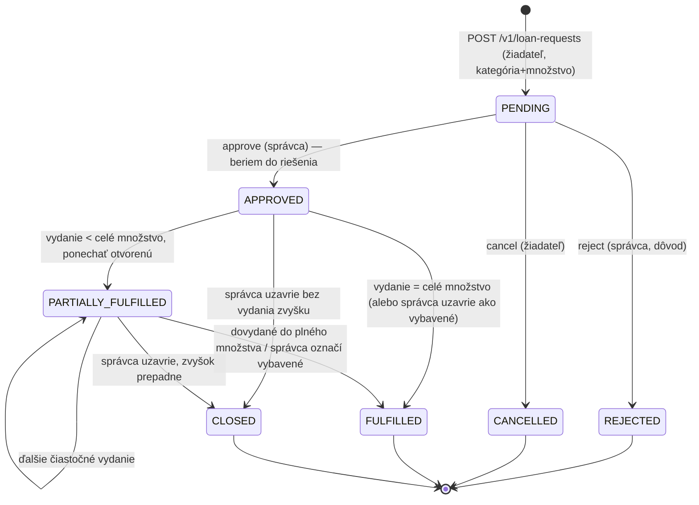

<!--
SPDX-FileCopyrightText: 2026 Ján Letko / LTK Solutions
SPDX-License-Identifier: CC-BY-4.0
-->

# 0026. Katalógové žiadosti (kategória + množstvo) + oddelené vydávanie

|                   |                                                                                                                                                                                                                                                                                                                                                                                                                                                                                                                                           |
| ----------------- | ----------------------------------------------------------------------------------------------------------------------------------------------------------------------------------------------------------------------------------------------------------------------------------------------------------------------------------------------------------------------------------------------------------------------------------------------------------------------------------------------------------------------------------------- |
| **Status**        | ✅ Accepted                                                                                                                                                                                                                                                                                                                                                                                                                                                                                                                               |
| **Dátum**         | 2026-06-01                                                                                                                                                                                                                                                                                                                                                                                                                                                                                                                                |
| **Autori**        | Ján Letko, Claude Opus 4.8 (LTK Solutions)                                                                                                                                                                                                                                                                                                                                                                                                                                                                                                |
| **Súvisiace ADR** | [0012 Loans state machine](0012-loans-state-machine.md) (prepisuje jadro — žiadosť už nie je viazaná na konkrétny asset), [0020 Sklad & BULK](0020-stock-and-bulk-items.md) (vydávanie mapuje kategória+množstvo → konkrétne kusy / BULK výdaj), [0022 Preberacie protokoly](0022-loan-protocol-pdf.md) (HANDOVER protokol vzniká pri `fulfil` — 1 žiadosť → N Loanov → N protokolov), [0023 Beneficiary + priamy loan](0023-loan-beneficiary-and-direct-loan.md), [0025 Open-ended výpožičky](0025-open-ended-loans-and-request-form.md) |

## Kontext

Pri prvom reálnom prechode formulárom „Nová žiadosť o výpožičku" na produkcii
(`app.inventario.estate`, 2026-06-01) vyšla najavo zásadná medzera v doménovom
modeli — nie bug, ale **chýbajúci typ žiadosti**.

Súčasný model (ADR-0012, 0023, 0025) pozná len **konkrétnu žiadosť**:
`LoanRequestItem` má povinné `assetId`, žiadateľ vyberá konkrétne inventárne čísla
z dostupného (AVAILABLE) majetku, a tie sa rezervujú už pri vytvorení žiadosti.

Reálne je ale ~95 % žiadostí **abstraktných / katalógových**: žiadateľ uvažuje
v **kategóriách a množstvách**, nie v inventárnych číslach. Píše:

> „potrebujem 1 projektor, 10 kužeľov, a myš ak je skladom"

Žiadateľ **nevie a nechce vedieť**, ktorý konkrétny projektor dostane. To rozhodne
**správca pri vydaní**. Toto bol od začiatku zámer — _žiadosť oddelená od vydania
konkrétneho majetku_ — ale model ho nikdy nezachytil.

Dôsledok dnešného modelu: formulár si pýta výber konkrétnych AVAILABLE kusov;
v prázdnom alebo nízko-zásobovom tenante niet čo vybrať, „Vybraný majetok (0/50)"
ostáva prázdny, a žiadosť sa nedá podať. Aj keby majetok bol, núti žiadateľa
rozhodovať o veci, ktorá mu neprislúcha.

### Načasovanie — prečo teraz, a nie po pilote

Toto je jediný správny moment a robíme to teraz, kým je systém prázdny:

- **Žiadne dáta.** Produkcia nemá žiadne žiadosti, žiadne výpožičky, žiadny majetok
  okrem testovacieho. Zmena stavového automatu = žiadna migrácia živých dát.
- **Loans nie sú v rozsahu pilota retroaktívne.** Keď SFZ v pilote začne tvoriť reálne
  žiadosti na novom modeli, nebude existovať starý model, z ktorého by sa migrovalo.
- **Odklad = bolesť.** O mesiac na živých dátach by prepis FSM žiadosti (PENDING→APPROVED
  s rezerváciou konkrétneho assetu → katalógový model) bol riziková migrácia. Teraz je to
  čistý prepis.
- **ADR-0012 to predvídal.** Možnosť C v ADR-0012 bola vedome MVP „bez pilot feedbacku";
  toto JE ten feedback (z vlastného reálneho použitia), ktorý dovoľuje navrhnúť model
  správne.

### Obmedzenia

- Solo dev, pred prvým pilotom. Model musí byť správny a kompletný, ale nesmie skĺznuť
  do plného skladového/objednávkového ERP.
- Schémy sú jediný zdroj pravdy (Zod → TS → JSON Schema → Mongo `$jsonSchema` → OpenAPI).
  Zmena sa premietne všade — návrh musí byť konzistentný a forward-compatible.
- Transakčná disciplína (ADR-0005) a audit log (Phase D) sú zavedené; nový model ich
  rešpektuje.
- Prelínanie s ADR-0020 (sklad/BULK) — „10 kužeľov" je natívne BULK množstevný výdaj,
  „1 projektor" je serializovaný kus z kategórie. Model musí pokryť oboje.

## Možnosti

### Paradigma žiadosti

#### Možnosť A: Ponechať konkrétnu žiadosť (status quo)

Žiadateľ vždy vyberá konkrétne `assetId`.

- Plus: žiadna zmena, rezervácia funguje tak ako v ADR-0012.
- Mínus: nepoužiteľné pre 95 % reálnych žiadostí; núti žiadateľa rozhodovať o veci,
  ktorú má rozhodnúť správca; v nízko-zásobovom tenante sa žiadosť nedá podať vôbec.

#### Možnosť B: Oba typy paralelne (konkrétny + katalógový)

Žiadateľ si zvolí, či žiada konkrétny kus alebo kategóriu+množstvo.

- Plus: pokrýva aj zriedkavý prípad „chcem presne tento kus".
- Mínus: dva kódové toky všade (formulár, validácia, vydanie, FSM); zdvojená údržbová
  plocha pre solo dev; UX rozhodnutie navyše pre žiadateľa pri každej žiadosti. A keďže
  _„správca aj tak rozhodne, čo vydá"_, konkrétny výber žiadateľa je beztak len
  nezáväzný návrh — paralelný tok by pridal komplexitu bez úmernej hodnoty.

#### Možnosť C: Len katalógová žiadosť (zvolené)

Žiadateľ zadáva **výlučne** kategória + množstvo + voľná poznámka. Konkrétny výber
inventárnych čísel v žiadosti sa **ruší**. Konkrétny majetok priraďuje správca pri vydaní.

- Plus: jeden tok, zodpovedá realite; žiadateľ uvažuje prirodzene (v kategóriách);
  jediný gatekeeper je správca; čistý model bez modálneho „typu žiadosti".
- Mínus: ak by niekto naozaj chcel „presne tento kus", nedá sa to vyjadriť v žiadosti
  (rieši sa poznámkou alebo priamym loanom správcu — `POST /v1/loans`, ADR-0023, ostáva).

### Rezervácia zásoby počas PENDING

#### Možnosť A: Rezervovať pri vytvorení žiadosti (ADR-0012 status quo)

Nedáva zmysel — pri katalógovej žiadosti nie je čo rezervovať (nevieme, ktorý kus).

#### Možnosť B: Rezervovať pri schválení

Správca pri approve vyberie a rezervuje konkrétne kusy.

- Mínus: zavádza rezervačný medzistav; pri „splniť čo sa dá" + viac vydaní v čase je
  rezervácia neprirodzená (čo so zvyškom?).

#### Možnosť C: Nerezervovať vôbec — evidencia dopytu (zvolené)

Žiadosť **nedrží žiadnu zásobu**. Dostupnosť sa rieši až pri samotnom vydaní, kde správca
vidí aktuálny stav skladu.

- Plus: najjednoduchší a najpoctivejší model; žiadosť nesľubuje nič, čo nemusí byť pravda;
  žiadny problém s expiráciou rezervácií; celá zodpovednosť za realitu zásob je na správcovi
  v momente vydania.
- Mínus: viac žiadostí môže „vyzerať splniteľne", než je reálna zásoba — ale to je
  realita dopytu, nie chyba. Správca vidí konflikt pri vydaní (kde aj tak rozhoduje).

## Rozhodnutie

Zvolili sme **Možnosť C (len katalógová žiadosť) + Možnosť C (nerezervovať)**, s nasledujúcim
úplným modelom. Celý cieľový rozsah implementujeme naraz (rozhodnutie 2026-06-01: systém je
prázdny, fázovanie by len odložilo nevyhnutné).

### Jadro modelu

> **Žiadosť je formálny dopyt vyjadrený v reči kategórií a množstiev. Nedrží zásobu.
> Správca je jediný gatekeeper — pri vydaní namapuje kategória+množstvo na konkrétne kusy
> (alebo BULK množstvo) a vydá. Vydaním vzniká `Loan` s konkrétnymi `assetId`. Jedna žiadosť
> môže viesť k viacerým výpožičkám (Loan) postupne v čase.**

### Rozhodnutia v bodoch (zdroj — diskusia 2026-06-01)

| Aspekt                       | Rozhodnutie                                                                                                                             |
| ---------------------------- | --------------------------------------------------------------------------------------------------------------------------------------- |
| **Typ žiadosti**             | Len katalógová (kategória + množstvo). Konkrétny výber `assetId` v žiadosti zrušený.                                                    |
| **Položka žiadosti**         | `categoryId` + `quantity` (pevné číslo, nie rozsah) + voliteľná poznámka.                                                               |
| **Mäkké podmienky**          | Žiadny per-item „optional" príznak. Celá žiadosť má povahu **„splniť čo sa dá"** — žiadna položka nie je tvrdá.                         |
| **Rezervácia počas PENDING** | Žiadna. Žiadosť nedrží zásobu. Dostupnosť sa rieši pri vydaní.                                                                          |
| **Schvaľovanie**             | Ostáva: PENDING → APPROVED (správca). Approve = „beriem do riešenia", NIE vydanie.                                                      |
| **Vydanie**                  | Samostatný krok po approve. Správca mapuje kategória+množstvo → konkrétne kusy / BULK množstvo a vydá.                                  |
| **Vzťah žiadosť ↔ Loan**     | 1 žiadosť → N Loanov postupne v čase. Každé vydanie = samostatný Loan.                                                                  |
| **Čiastočné vydanie**        | Povolené (žiadaných 10, vydá 8). Vyplýva z „splniť čo sa dá".                                                                           |
| **Po čiastočnom vydaní**     | Správca rozhodne: nechať žiadosť otvorenú (PARTIALLY_FULFILLED, príde ešte vydanie) alebo uzavrieť (FULFILLED/CLOSED, zvyšok prepadne). |
| **Množstvo**                 | Pevné celé číslo ≥ 1. (Rozsah min–max odložený, Fáza 2 ak vôbec.)                                                                       |

### Stavový automat — `LoanRequest` (NOVÝ)

Nahrádza FSM z ADR-0012 (`PENDING → APPROVED → terminal`, kde APPROVED = okamžitý pickup).

Nové stavy (`LoanRequestStatus`):

| Stav                  | Význam                                                                                  |
| --------------------- | --------------------------------------------------------------------------------------- |
| `PENDING`             | Vytvorená, čaká na rozhodnutie správcu.                                                 |
| `APPROVED`            | Schválená, ešte nič nevydané. Čaká na (prvé) vydanie.                                   |
| `PARTIALLY_FULFILLED` | Aspoň jedno vydanie prebehlo, ale nie celé žiadané množstvo, a žiadosť ostáva otvorená. |
| `FULFILLED`           | Vydané celé žiadané množstvo (alebo správca uzavrel ako kompletne vybavené).            |
| `CLOSED`              | Správca uzavrel s nevydaným zvyškom (zvyšok prepadol). Terminálny.                      |
| `REJECTED`            | Zamietnutá správcom pred akýmkoľvek vydaním. Terminálny.                                |
| `CANCELLED`           | Zrušená žiadateľom pred akýmkoľvek vydaním. Terminálny.                                 |



**Poznámka k OVERDUE/protokolom/auditu:** všetko, čo sa viaže na konkrétny majetok
(OVERDUE výpočet, kondícia, protokoly PDF — ADR-0022, audit konkrétneho kusu), platí
**až na úrovni `Loan`**, ktorý vzniká vydaním. Žiadosť sama o sebe nemá termín vrátenia
ani OVERDUE — to nesie až výsledný Loan (s `dueAt` per ADR-0025, vrátane open-ended).

### Dátový model — zmeny v `loan.ts`

**`LoanRequestItem` — prepísaný:**

```
- assetId                 (ZRUŠENÉ — žiadosť už neviaže konkrétny kus)
- snapshot {inv, name}    (ZRUŠENÉ — niet konkrétny kus na snapshot)
- status / substitution   (ZRUŠENÉ — per-item approval z ADR-0012 MVP nepoužité)
+ categoryId: ObjectId    (povinné — čo žiadateľ chce)
+ quantityRequested: int ≥ 1
+ quantityFulfilled: int ≥ 0, default 0   (koľko z toho už bolo vydané — naprieč Loanmi)
+ note: string | null     (voliteľná per-item poznámka)
+ categorySnapshot { name, slug }  (názov kategórie v čase žiadosti — pre stabilné zobrazenie)
```

**`LoanRequest` — úpravy:**

- `items[]` → nové `LoanRequestItem` (kategória+množstvo).
- `status` → nový `LoanRequestStatus` (7 stavov vyššie).
- `resultingLoanId: ObjectId | null` → **`resultingLoanIds: ObjectId[]`** (1 žiadosť → N Loanov).
- `plannedFrom` / `plannedTo` ostávajú (per ADR-0025; plannedTo nullable = „do odvolania");
  sú to **želané** termíny — záväzný `dueAt` sa nastaví až na Loan pri vydaní.
- `beneficiaryId` ostáva (ADR-0023).
- `approvers[]`, `teamId`, `idempotencyKey` — ostávajú v schéme, MVP ich nemení (forward-compat).

**`Loan` — bez zmeny štruktúry**, ale `requestId` teraz odkazuje na katalógovú žiadosť
(alebo null pri priamom loane, ADR-0023). `Loan.items[]` ostáva so SERIALIZED `assetId`
aj BULK množstevným variantom (ADR-0020). Vydanie z katalógovej žiadosti je presne to,
čo naplní `Loan.items`.

### Tok vydávania (`POST /v1/loan-requests/:id/fulfil` — NOVÝ endpoint)

Po `approve` správca vydáva. Telo požiadavky mapuje položky žiadosti na konkrétny majetok:

```
POST /v1/loan-requests/:id/fulfil
{
  "items": [
    { "requestItemId": "...", "assetIds": ["...", "..."] },          // SERIALIZED: konkrétne kusy
    { "requestItemId": "...", "bulkItemId": "...", "quantity": 8 }    // BULK: množstvo z položky
  ],
  "dueAt": "2026-06-30T..." | null,   // záväzný termín pre tento Loan (ADR-0025)
  "closeRemainder": false             // true = po tomto vydaní uzavrieť žiadosť (CLOSED)
}
```

V jednej Mongo transakcii:

1. Vytvorí `Loan` (status ACTIVE) s vydanými položkami, `borrowerId = beneficiaryId`,
   `dueAt` z tela, `requestId = :id`.
2. SERIALIZED assety `AVAILABLE → BORROWED`; BULK `LOAN_OUT` pohyb v stock ledgeri (ADR-0020).
3. Pripíše `Loan._id` do `request.resultingLoanIds`.
4. Zvýši `quantityFulfilled` na príslušných položkách žiadosti.
5. Prepočíta stav žiadosti:
   - všetky položky `quantityFulfilled >= quantityRequested` → `FULFILLED`;
   - `closeRemainder === true` → `CLOSED`;
   - inak → `PARTIALLY_FULFILLED`.
6. Audit log: `loan_request.fulfilled` + `loan.created` (atomicky).

Validácia pri vydaní (nie pri žiadosti) zabezpečuje dostupnosť — žiadosť mohla žiadať
viac, než je dnes skladom; správca vydá, čo môže.

### Endpoint inventory — zmeny oproti ADR-0012

| Endpoint                              | Zmena                                                                              |
| ------------------------------------- | ---------------------------------------------------------------------------------- |
| `POST /v1/loan-requests`              | Telo: kategória+množstvo namiesto assetId. Žiadna rezervácia.                      |
| `POST /v1/loan-requests/:id/approve`  | Ostáva, ale **už nevytvára Loan** — len PENDING → APPROVED.                        |
| `POST /v1/loan-requests/:id/fulfil`   | **NOVÝ** — vydanie (mapovanie na kusy/BULK, vznik Loanu, prepočet stavu žiadosti). |
| `POST /v1/loan-requests/:id/reject`   | Ostáva (len z PENDING). Žiadne uvoľnenie rezervácie (niet čo).                     |
| `DELETE /v1/loan-requests/:id`        | Cancel žiadateľom (len z PENDING).                                                 |
| `POST /v1/loans` (direct)             | Ostáva bez zmeny (ADR-0023) — správca rovno vydá bez žiadosti.                     |
| `POST /v1/loans/:id/return` / `/lost` | Bez zmeny — operujú na Loane.                                                      |

### Migrácia

**Žiadna migrácia dát** — produkcia je prázdna (žiadne `loan_requests`, `loans`).
Iba schema/index zmena. Ak by predsa existovali testovacie záznamy, vyčistia sa ručne.

Indexy:

```js
// loan_requests
{ organisationId: 1, status: 1, requesterId: 1, createdAt: -1 }
{ organisationId: 1, "items.categoryId": 1 }   // namiesto items.assetId
```

## Dôsledky

### Pozitívne

- Model zodpovedá ~95 % reálnych žiadostí; žiadateľ uvažuje prirodzene (kategória+množstvo).
- Žiadosť oddelená od vydania — pôvodný zámer konečne zachytený v dátach.
- Žiadosť sa dá podať aj v prázdnom/nízko-zásobovom tenante (nerezervuje).
- Prelína sa čisto s ADR-0020: BULK výdaj „10 kužeľov" je natívny, SERIALIZED „1 projektor"
  tiež. Jeden tok vydania pre oboje.
- Žiadna migrácia — robené v prázdnom systéme.
- Správca je jediný gatekeeper reality zásob, v momente keď ju aj vidí.

### Negatívne / kompromisy

- **Zložitejší FSM žiadosti** než ADR-0012 (7 stavov, viac vydaní, `quantityFulfilled`
  tracking). Reálna práca, ale nevyhnutná pre cieľový model.
- **Konkrétny výber kusu žiadateľom zaniká.** Kto naozaj chce „presne tento", rieši to
  poznámkou alebo priamy loan robí správca. Akceptované — správca aj tak rozhoduje.
- **Žiadosť môže „sľubovať" viac, než je skladom.** Vedomé — žiadosť je dopyt, nie rezervácia.
- `resultingLoanId` → `resultingLoanIds[]` je breaking zmena v shape — ale keďže loans nie sú
  implementované, nie je čo lámať.

### Riziká, ktoré treba sledovať

- **Súbeh vydaní**: dvaja správcovia vydávajú z tej istej žiadosti súčasne. `quantityFulfilled`
  inkrement + asset `AVAILABLE → BORROWED` musí byť atomické v transakcii; testovať explicitne.
- **Over-fulfilment**: vydať viac, než žiadané (`quantityFulfilled > quantityRequested`).
  Service musí strážiť strop (alebo vedome povoliť? — default: nepovoliť, vydanie nesmie
  prekročiť žiadané množstvo položky).
- **„Zaseknutá" APPROVED žiadosť** bez vydania — analogicky k ADR-0012 stuck PENDING.
  Mitigácia: ADMIN môže `CLOSED`-núť kedykoľvek; auto-expirácia odložená (Fáza 2).
- **UI vydávania** pre správcu (mapovanie kategória → konkrétne kusy/BULK) je nová obrazovka
  — netriviálny frontend kus.

## Fázovanie / odložené (Fáza 2)

- **Rozsah množstva** (min–max „10–15") namiesto pevného čísla.
- **Per-item „nepovinné"** príznaky (teraz pokryté celkovým „splniť čo sa dá").
- **`Category.allowOpenEnded`** (ktoré kategórie smú „do odvolania") — z ADR-0025 Fáza 2.
- **Auto-expirácia** APPROVED/PENDING žiadostí cron jobom.
- **Multi-approver routing** podľa `Category.approverIds` (z ADR-0012, stále odložené).
- **Notifikácie** o čiastočnom vydaní / čakajúcom zvyšku.

## Sub-task breakdown

| Blok   | Popis                                                                                                                                                                                                                                                                        | Model  |
| ------ | ---------------------------------------------------------------------------------------------------------------------------------------------------------------------------------------------------------------------------------------------------------------------------- | ------ |
| **K1** | `loan-status.ts` — nový `LoanRequestStatus` (7 stavov). `loan.ts` — prepísaný `LoanRequestItem` (categoryId+quantity), `resultingLoanIds[]`. Regen JSON Schema + openapi.                                                                                                    | Sonnet |
| **K2** | Repository — `loan_requests` indexy (items.categoryId), helper `incrementFulfilled`. Service — nový FSM: `createCatalogRequest`, `approveRequest` (bez Loanu), `fulfilRequest` (transakčné vydanie + Loan + stock pohyb + prepočet stavu), `rejectRequest`, `cancelRequest`. | Sonnet |
| **K3** | Routes — `POST /v1/loan-requests` (kategória+množstvo), `approve` (len stav), **`fulfil`** (nový), `reject`, `cancel`. RBAC: create EMPLOYEE+, approve/fulfil/reject ASSET_MANAGER+ADMIN.                                                                                    | Sonnet |
| **K4** | Frontend `/loans/request` — kategória+množstvo formulár (žiadny asset picker). `useCategories` + množstvo + poznámka. Beneficiary + termín ostávajú (ADR-0023/0025).                                                                                                         | Sonnet |
| **K5** | Frontend — obrazovka vydávania pre správcu (`/loans/:id/fulfil` alebo modal): mapovanie položiek na konkrétne kusy / BULK množstvo, čiastočné vydanie, uzavretie zvyšku.                                                                                                     | Sonnet |
| **K6** | Tests — FSM prechody (PENDING→APPROVED→PARTIALLY_FULFILLED→FULFILLED/CLOSED), čiastočné vydanie, viac Loanov z jednej žiadosti, over-fulfilment guard, súbeh vydaní, RBAC, cross-tenant.                                                                                     | Sonnet |
| **K7** | OpenAPI + api-types regen. Devlog + milestone doc. Aktualizovať ADR-0012/0020/0023/0025 cross-linky (tento ADR mení ich predpoklady).                                                                                                                                        | Haiku  |

## Referencie

- [ADR-0012 Loans state machine](0012-loans-state-machine.md) — pôvodný FSM, ktorý tento ADR prepisuje
- [ADR-0020 Sklad & BULK](0020-stock-and-bulk-items.md) — vydávanie mapuje na SERIALIZED kusy / BULK množstvo
- [ADR-0023 Beneficiary + priamy loan](0023-loan-beneficiary-and-direct-loan.md) — beneficiaryId, direct loan ostávajú
- [ADR-0025 Open-ended výpožičky](0025-open-ended-loans-and-request-form.md) — dueAt nullable na Loane pri vydaní
- [packages/shared-types/src/schemas/loan.ts](../../packages/shared-types/src/schemas/loan.ts) — schémy na prepis
- [packages/shared-types/src/enums/loan-status.ts](../../packages/shared-types/src/enums/loan-status.ts) — LoanRequestStatus na rozšírenie
