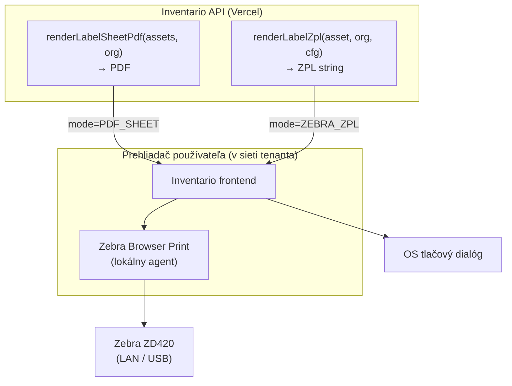

<!--
SPDX-FileCopyrightText: 2026 Ján Letko / LTK Solutions
SPDX-License-Identifier: CC-BY-4.0
-->

# 0027. Tlač QR štítkov — Avery PDF hárky (default) + Zebra ZPL (opt-in)

|                   |                                                                                                                                                                                                                                                                                                        |
| ----------------- | ------------------------------------------------------------------------------------------------------------------------------------------------------------------------------------------------------------------------------------------------------------------------------------------------------ |
| **Status**        | ✅ Accepted                                                                                                                                                                                                                                                                                            |
| **Dátum**         | 2026-06-01                                                                                                                                                                                                                                                                                             |
| **Autori**        | Ján Letko, Claude Opus 4.8 (LTK Solutions)                                                                                                                                                                                                                                                             |
| **Súvisiace ADR** | [0021 QR kódy majetku](0021-asset-qr-codes.md) (rozširuje — Fáza 2 „PDF hárky štítkov"), [0010 Multi-tenant white-label](0010-multi-tenant-white-label.md), [0022 Loan protocol PDF](0022-loan-protocol-pdf.md) (zdieľa on-demand render princíp), [0011 EUPL licensing](0011-licensing-eupl-reuse.md) |

## Kontext

ADR-0021 rozhodol **čo** je v QR (`publicToken` v URL viazanej na `appBaseUrl`) a **že**
sa QR renderuje on-demand (`GET /v1/assets/:id/qr`). Vedome odložil **ako sa QR dostane
na fyzický štítok nalepený na majetku** — vo Fáze 2 ako LOW priorita „PDF hárky štítkov /
batch tlač".

Toto ADR tú medzeru uzatvára. Rozhodnutie má dve roviny, ktoré sa nesmú miešať:

1. **Kvalita štítka** — čím sa tlačí a na čo. (Rozhodnuté mimo ADR: termotlač na kvalitný
   podklad je cieľ pre trvanlivé štítky; Zebra ZD420 je referenčný hardvér, ktorý SFZ má.)
2. **Architektúra doručenia** — ako sa QR/štítok dostane z cloud aplikácie na tlačiareň.
   Toto je skutočné architektonické rozhodnutie a jadro tohto ADR.

Treba rozhodnúť **päť vecí**:

1. Aký je **default** spôsob tlače, ktorý funguje pre každého tenanta bez špeciálneho hardvéru.
2. Ako sa podporí **Zebra/ZPL** pre tenantov s termotlačiarňou (kvalita), bez zabetónovania
   produktu do jedného výrobcu.
3. Ako sa **ZPL fyzicky dostane na tlačiareň** z cloud SaaS na Verceli.
4. Kde sa **generuje ZPL** a kto vlastní formát štítka.
5. **Layout štítka a sprievodný text** — čo je na štítku okrem QR a ako riešiť výzvu pre
   nálezcu („nasken-uj ma") bez zhoršenia čitateľnosti QR.

### Obmedzenia

- **Cloud API nevidí do lokálnej siete tenanta.** Inventario API beží na Verceli.
  Zebra ZD420 v kancelárii SFZ je na `192.168.x.x` v ich LAN. **Vercel sa na túto IP
  nedostane.** Akékoľvek riešenie „backend pošle ZPL priamo na tlačiareň" pre sieťovo
  izolované tlačiarne **nefunguje** — doručenie musí vychádzať z prehliadača používateľa,
  ktorý JE v rovnakej sieti ako tlačiareň.
- **Prehliadač nevie natívne tlačiť ZPL.** Web app nemá prístup k USB/sieťovej tlačiarni
  cez ZPL. Buď cez lokálny agent (Zebra Browser Print), alebo cez OS tlačový dialóg (a to
  je už PDF/obrázok, nie ZPL), alebo priamy HTTP POST na IP tlačiarne (ten ale Zebra
  tlačiarne servujú **bez CORS hlavičiek**, takže priamo z prehliadača to nejde).
- **Multi-tenant white-label (ADR-0010).** Drvivá väčšina tenantov (mestá, školy, malé
  zväzy) **nemá** Zebra tlačiareň. Default musí fungovať na bežnej kancelárskej
  laserovej/atramentovej tlačiarni. Zebra je výnimka s dobrým vybavením (SFZ), nie typický tenant.
- **On-demand princíp (ADR-0021, ADR-0022).** „Generuj on-demand, neukladaj odvoditeľné."
  Štítok (PDF aj ZPL) je čistá funkcia QR dát → patrí medzi generované, nie uložené artefakty.
- **Forky (ADR-0010).** Štítok kóduje `{appBaseUrl}/scan/{publicToken}` — doména z tenant
  configu, nikdy hardkódovaná. Platí rovnako pre PDF aj ZPL výstup.
- **Determinizmus a kvalita QR modulu.** Pri termotlači je veľkosť QR modulu (bodov na modul)
  kritická pre čitateľnosť — príliš malý modul sa pri 203 dpi termohlave nezosníma. ZPL to
  rieši natívne (`^BQ` magnification), PDF rieši fyzickou veľkosťou.
- **QR čitateľnosť je nadradená estetike.** Sprievodný text ani grafika nesmú zhoršiť
  spoľahlivosť skenu — QR, ktorý sa nezosníma, je horší než nudný QR čo funguje vždy. Text
  v **strede** QR sa preto zamieta (prekrytie dát + termálna tlač pri 203 dpi = riziko
  nečitateľnosti); sprievodný text patrí **pod/vedľa** QR, nie doň.
- **Solo dev.** Riziko over-engineeringu (label designer UI, šablóny per tenant, šarže s
  rôznymi rozmermi) pred reálnym feedbackom z pilotu.

## Možnosti

### 1. Default spôsob tlače štítkov

#### Možnosť A: Avery-style PDF hárok (zvolené ako default)

Server vyrenderuje PDF s **mriežkou štítkov** na A4 (napr. 3×8 = 24 štítkov, Avery L7160
a podobné rozloženia). Každý štítok = QR + `inventoryNumber` + názov. Tenant vytlačí na
hárok samolepiacich štítkov na **akejkoľvek** tlačiarni.

- Plus: funguje pre 100 % tenantov bez špeciálneho hardvéru; rovnaký on-demand PDF princíp
  ako protokoly (ADR-0022, `pdf-lib`); Zebra ZD420 to vytlačí tiež (cez OS ovládač ako bežnú
  tlačiareň, hoci nie cez ZPL); batch (N assetov → jeden hárok) prirodzene rieši.
- Mínus: samolepiace hárky na laserovej tlačiarni nie sú také trvanlivé ako termotlač na
  kvalitný podklad; rozloženie mriežky je fixné (zopár preset rozmerov).

#### Možnosť B: Jednotlivý štítok PDF

Jeden asset → jedno malé PDF v rozmere štítka.

- Plus: jednoduché.
- Mínus: nerieši batch (24 assetov = 24 PDF a 24 tlačí); plytvanie pri hárkových štítkoch.

#### Možnosť C: Obrázok (PNG) na priame vloženie

- Plus: trivial.
- Mínus: bez layoutu, bez `inventoryNumber`, bez mriežky; používateľ si musí poskladať
  tlač sám. Nedostatočné.

### 2. Podpora Zebra/ZPL

#### Možnosť A: Žiadna — len PDF pre každého

- Plus: jeden výstupný formát, menej kódu.
- Mínus: tenanti s termotlačiarňou (SFZ) nedostanú kvalitu, na ktorú majú hardvér;
  premárnená príležitosť pri segmente veľkých organizácií.

#### Možnosť B: ZPL ako default, PDF fallback

- Plus: maximálna kvalita default.
- Mínus: **väčšina tenantov nemá Zebru** → default by pre nich nefungoval; zabetónovanie
  do jedného výrobcu; „ako toto vytlačím?" pre typického tenanta.

#### Možnosť C: PDF default + ZPL ako opt-in per tenant (zvolené)

Dvojvrstvový model. Default je Avery PDF (Možnosť 1A). Tenant s termotlačiarňou si v
nastaveniach prepne `labelPrinting.mode` na `ZEBRA_ZPL` a dostane natívny ZPL výstup.

- Plus: funguje pre každého (PDF) aj pre vybavených (ZPL kvalita); Zebra je first-class
  podporovaná, ale nie vynútená; produkt nie je viazaný na jeden hardvér; obe vetvy zdieľajú
  ten istý zdroj QR dát.
- Mínus: dve výstupné cesty (PDF render + ZPL builder) a dve doručovacie cesty (OS dialóg
  vs Browser Print). Vedome akceptované — je to cena za hardvér-agnostickosť.

### 3. Ako sa ZPL dostane na tlačiareň

#### Možnosť A: Backend POST priamo na IP tlačiarne

API spraví HTTP POST so ZPL na `http://{printerIp}/pstprnt`.

- Plus: nula lokálneho softvéru.
- Mínus: **nefunguje pre cloud SaaS** — Vercel nevidí na `192.168.x.x` v LAN tenanta;
  Zebra HTTP endpoint navyše neservuje CORS, takže ani z prehliadača priamo nie. Použiteľné
  len pre self-hosted fork s API v rovnakej sieti ako tlačiareň (okrajový prípad).

#### Možnosť B: Zebra Browser Print — lokálny agent (zvolené)

Tenant nainštaluje **Zebra Browser Print** (oficiálny Zebra agent) na PC, kde sa tlačí.
Agent beží lokálne, vystavuje JS API; frontend Inventario mu pošle ZPL string, agent ho
doručí na USB/sieťovú tlačiareň v lokálnej sieti.

- Plus: funguje pre cloud SaaS (doručenie vychádza z prehliadača usera, ktorý je v sieti
  tlačiarne); oficiálne podporované Zebrou; doručenie je čisto frontend záležitosť — **backend
  s tlačiarňou nikdy nekomunikuje**, ostáva tlačiareň-agnostický; veľké organizácie s tým
  nemajú problém (akceptované — SFZ má ZD420).
- Mínus: agent treba nainštalovať na každý PC, kde sa tlačí (jednorazovo); ďalší kus softvéru
  pre IT oddelenie tenanta.

#### Možnosť C: Chrome extension / tretí-stranný most

- Plus: bez inštalácie desktop agenta.
- Mínus: závislosť na neoficiálnom rozšírení; krehké pri zmenách prehliadača; menej dôveryhodné
  pre verejný sektor než oficiálny Zebra nástroj.

### 4. Kde sa generuje ZPL

#### Možnosť A: Vlastný ZPL string builder na backende (zvolené)

API má čistú funkciu `renderLabelZpl(asset, organisation, labelConfig) → string`, ktorá
poskladá ZPL príkaz (`^XA ... ^XZ`) vrátane QR (`^BQ`), `inventoryNumber` a názvu.

- Plus: plná kontrola nad layoutom a kvalitou (modul size, darkness, rozmery); žiadny závis;
  ZPL je len ďalší výstupný formát tých istých QR dát (paralela k SVG/PNG/PDF); deterministické.
- Mínus: ZPL syntax sa píše ručne (dobre zdokumentovaná, stabilná — akceptovateľné).

#### Možnosť B: npm knižnica (`zpl-js`, `zebra-browser-print-wrapper`)

- Plus: hotové API.
- Mínus: ďalší závis; `zpl-js` je „rough early release"; wrapper rieši hlavne doručenie (to
  je frontend), nie generovanie. Pre jednoduchý štítok je vlastný builder čistejší a bez závisu.

### 5. Layout štítka a sprievodný text pre nálezcu

#### Možnosť A: Len QR + `inventoryNumber`

- Plus: najjednoduchšie, maximálny priestor pre QR.
- Mínus: štítok nekomunikuje účel; nálezca nevie, že má skenúť, ani prečo.

#### Možnosť B: Text v **strede** QR („nasken-uj ma")

- Plus: vizuálne podmanívé.
- Mínus: prekrytie dát QR → spolieha sa na error correction; pri termotlači na malý štítok
  (203 dpi) reálne riziko nečitateľnosti. **Zamietnuté** — QR čitateľnosť je nadradená (viď obmedzenia).

#### Možnosť C: Sprievodný text **pod** QR + voliteľné logo v strede (zvolené)

Štítok = QR (s voliteľným malým logom organizácie v strede, overený vzor cez vysoký error
correction) + `inventoryNumber` + skrátený názov + **sprievodný text pod QR** (napr.
„Našli ste ma? Naskenujte a pomôžte ma vrátiť."). Text je **per-tenant konfigurovateľný**
s rozumným defaultom a **samostatným prepínačom** či sa vôbec zobrazí.

- Plus: štítok komunikuje účel a vyzve nálezcu; QR ostane plne čitateľný; logo v strede je
  overený vzor (nie text); tenant si text prispôsobí (jazyk, tón, kontakt).
- Mínus: text zaberie trochu miesta na štítku (pri veľmi malých termálnych štítkoch sa
  vynechá — prepínač to umožňuje).

> **Väzba na `publicAssetLookup` (ADR-0021):** ak má tenant verejný lookup **vypnutý**,
> sken nálezcom skončí na logine — výzva „naskenuj ma" by bola falšový sľub. Preto je
> zobrazenie textu riadené **samostatným prepínačom** (`labelFinderText.enabled`), o ktorom
> rozhoduje tenant — typicky ho zapne práve vtedy, keď má zapnutý aj verejný lookup. UI to
> naznačí (hint), ale nevynúti tvrdo (tenant môže chcieť text aj pri internom kontakte).

## Rozhodnutie

### 1. Default: Avery-style PDF hárok (Možnosť 1A)

- `GET /v1/labels/sheet?assetIds=...&layout=avery-l7160` (alebo POST s telom pre veľké dávky)
  → on-demand PDF s mriežkou štítkov. `pdf-lib` (rovnaký stack ako ADR-0022 protokoly,
  vrátane embedovaného DejaVu Sans pre diakritiku).
- Každý štítok: QR (`{appBaseUrl}/scan/{publicToken}`) + `inventoryNumber` + skrátený názov.
- **Preset rozloženia** (nie voľný layout editor): zopár bežných Avery rozmerov. Default
  jeden, ostatné podľa potreby. Mriežka, počet na hárok a okraje sú per-preset konštanty.
- Funguje pre 100 % tenantov; Zebra ZD420 vytlačí PDF tiež (cez OS ovládač).

### 2. Zebra ZPL: opt-in per tenant (Možnosť 2C)

Rozšírenie `Organisation` schémy (nová `OrganisationLabelSettingsSchema`):

```ts
labelPrinting: {
  mode: 'PDF_SHEET' | 'ZEBRA_ZPL';        // default PDF_SHEET
  // Voliteľné ZPL parametre (platné len pre ZEBRA_ZPL):
  zplLabelWidthMm: number;                 // šírka štítka v mm (napr. 50)
  zplLabelHeightMm: number;                // výška štítka v mm (napr. 25)
  zplDpi: 203 | 300;                        // hustota tlačovej hlavy (ZD420 = 203 default)
  zplDarkness: number;                      // 0–30, sýtosť termotlače
  // Sprievodný text pre nálezcu (rozhodnutie 6) — platí pre PDF aj ZPL:
  finderText: {
    enabled: boolean;                       // default false — samostatný prepínač
    text: string;                           // default „Našli ste ma? Naskenujte a pomôžte ma vrátiť."
  };
} | null;                                   // null = default PDF_SHEET + finderText vypnutý
```

- `null` alebo `mode: PDF_SHEET` → tenant používa Avery PDF (default).
- `mode: ZEBRA_ZPL` → frontend ponúkne „Tlačiť na Zebra" a použije ZPL endpoint + Browser Print.
- Zebra **nie je default**, ale je **first-class** podporovaná.

### 3. ZPL doručenie cez Zebra Browser Print (Možnosť 3B)

- Frontend integruje **Zebra Browser Print** JS API (lokálny agent na PC tenanta).
- Tok: frontend si vyžiada ZPL string z API → odovzdá ho Browser Print agentovi → agent
  doručí na tlačiareň v lokálnej sieti.
- **Backend nikdy nekomunikuje s tlačiarňou.** API len vygeneruje ZPL string; doručenie je
  čisto frontend + lokálny agent. Tým ostáva cloud API tlačiareň-agnostické a funguje aj
  pri sieťovo izolovaných tlačiarňach.
- Priamy HTTP POST na IP tlačiarne (Možnosť 3A) je **mimo rozsah** — nefunguje pre cloud
  deployment (Vercel nevidí do LAN tenanta, Zebra HTTP endpoint nemá CORS).



### 4. Vlastný ZPL string builder na backende (Možnosť 4A)

- `GET /v1/assets/:id/label?format=zpl` (jeden) a `POST /v1/labels/zpl` (dávka) →
  `application/json` alebo `text/plain` so ZPL stringom (nie binárka — frontend ho podáva agentovi).
- `renderLabelZpl(asset, organisation, labelConfig) → string` — čistá funkcia, žiadny závis,
  deterministická. QR cez `^BQ`, text cez `^FD`, rozmery z `labelPrinting` configu.
- ZPL je **len ďalší výstupný formát** tých istých QR dát — paralela k existujúcemu
  `GET /v1/assets/:id/qr?format=svg|png` z ADR-0021.

### 5. Layout štítka + sprievodný text pod QR (Možnosť 5C)

- **Layout štítka** (PDF aj ZPL): QR + `inventoryNumber` + skrátený názov + (ak zapnutý)
  sprievodný text **pod** QR. Voliteľné malé logo organizácie **v strede** QR
  (`brandKit.logoUrl`, vysoký error correction) — logo, NIE text.
- **Text NIKDY v strede QR** — prekrytie dát pri termotlači 203 dpi je riziko nečitateľnosti
  (viď obmedzenia). QR čitateľnosť má vždy prednosť.
- **Sprievodný text** je per-tenant konfigurovateľný (`labelPrinting.finderText`):
  - `enabled: boolean` — default `false`, samostatný prepínač
  - `text: string` — default „Našli ste ma? Naskenujte a pomôžte ma vrátiť." (tenant zmení
    jazyk/tón; prazdny pri vypnutom)
- **Väzba na `publicAssetLookup`:** UI navedie tenanta, že text dáva zmysel najmä s zapnutým
  verejným lookupom (inak sken nálezcom skončí na logine). Hint, nie tvrdé vynútenie — tenant
  môže chcieť text aj pri internom procese vrátenia.
- Render číta text zo `labelPrinting.finderText` — deterministický, rovnako pre PDF aj ZPL.

### 6. Endpoint inventory (návrh)

| Method | Path                                | Výstup                          | Roly      |
| ------ | ----------------------------------- | ------------------------------- | --------- |
| `GET`  | `/v1/assets/:id/qr?format=svg\|png` | QR obrázok (ADR-0021, existuje) | EMPLOYEE+ |
| `GET`  | `/v1/assets/:id/label?format=zpl`   | ZPL string pre jeden štítok     | EMPLOYEE+ |
| `GET`  | `/v1/labels/sheet?assetIds=...`     | Avery PDF hárok (on-demand)     | EMPLOYEE+ |
| `POST` | `/v1/labels/zpl`                    | ZPL string(y) pre dávku         | EMPLOYEE+ |

Žiadny endpoint neukladá artefakt — všetko on-demand zo `publicToken` + `appBaseUrl` +
`labelPrinting` configu (princíp ADR-0021/0022).

## Dôsledky

### Pozitívne

- **Funguje pre každého** (PDF default) **aj pre vybavených** (ZPL kvalita) — bez zabetónovania
  do jedného výrobcu.
- Cloud API ostáva **tlačiareň-agnostické** — nikdy nekomunikuje s hardvérom; doručenie je
  frontend + lokálny agent.
- Funguje pri **sieťovo izolovaných tlačiarňach** (typická realita LAN), kde by backend-POST
  zlyhal.
- ZPL aj PDF zdieľajú **jeden zdroj QR dát** (`publicToken`, `appBaseUrl`) — konzistentné s
  ADR-0021, korektné pre forky.
- On-demand render, žiadna perzistencia štítkov — konzistentné s ADR-0021/0022.
- Vlastný ZPL builder = plná kontrola kvality (modul size, darkness) bez závisu.
- **Sprievodný text pod QR** (opt-in, per-tenant) komunikuje účel štítka a vyzve nálezcu, bez
  zhoršenia čitateľnosti QR (text pod, nie v strede; logo v strede ostáva ako overený vzor).
- Uzatvára vedome odloženú Fázu 2 z ADR-0021.

### Negatívne / kompromisy

- Dve výstupné cesty (PDF render + ZPL builder) a dve doručovacie cesty (OS dialóg vs
  Browser Print). Vedome akceptované za hardvér-agnostickosť.
- Zebra Browser Print vyžaduje inštaláciu agenta na každý tlačový PC (jednorazovo; akceptované
  — segment veľkých organizácií s tým nemá problém).
- ZPL syntax sa píše ručne (dobre zdokumentovaná, stabilná).
- Preset Avery rozloženia (nie voľný layout editor) — zámerné zúženie proti over-engineeringu.

### Riziká, ktoré treba sledovať

- **QR modul size pri termotlači.** Príliš malý modul sa pri 203 dpi nezosníma. Mitigácia:
  rozumný default `^BQ` magnification pre daný `zplLabelWidthMm`, test naskenovaním reálneho
  štítka z ZD420 počas pilotu.
- **Browser Print verzie / prehliadač.** Agent historicky mal kompatibilné lapsusy
  (staršie Firefox verzie). Mitigácia: cieliť Chrome/Edge (chromium), dokumentovať podporované
  prehliadače; ak agent nebeží, frontend padne späť na PDF.
- **Diakritika v ZPL.** ZPL default code page nemusí pokrývať `ľščťžáý`. Mitigácia: nastaviť
  `^CI28` (UTF-8) v ZPL hlavičke; test SK znakov na reálnej tlačiarni.
- **Fork bez Zebry.** Self-hosted fork bez termotlačiarne používa PDF default — žiadna zmena,
  funguje out-of-the-box.
- **Determinizmus.** PDF hárok by mal byť deterministický (rovnaký princíp ako ADR-0022:
  `CreationDate`/`ModDate` nie `now()`), ZPL string je inherentne deterministický.

## Fázovanie

### Fáza 1 — Avery PDF default + Zebra ZPL (rozsah dohodnutý „celé naraz")

- **L1** — `OrganisationLabelSettingsSchema` (`labelPrinting` vrátane `finderText`) na
  `Organisation`; regen JSON Schema + OpenAPI; doplniť `labelPrinting: null` do všetkých
  org-create ciest (JIT, register, oauth, test fixtures) — **pozor**, rovnaká pasca ako
  `protocolSettings` (ADR-0022 K1). (Haiku/Sonnet)
- **L2** — `renderLabelSheetPdf(assets, organisation, preset) → Uint8Array`: Avery mriežka,
  QR + inventoryNumber + názov + (ak `finderText.enabled`) text pod QR; voliteľné logo v strede
  QR; embedovaný DejaVu Sans, ≥1 preset rozloženie, deterministický render. (Sonnet)
- **L3** — `renderLabelZpl(asset, organisation, labelConfig) → string`: vlastný ZPL builder,
  `^BQ` QR + `^FD` text (inventoryNumber, názov, + finderText ak zapnutý) + `^CI28` UTF-8,
  rozmery z `labelPrinting`. (Sonnet)
- **L4** — routes: `GET /v1/labels/sheet`, `GET /v1/assets/:id/label?format=zpl`,
  `POST /v1/labels/zpl`; RBAC EMPLOYEE+; on-demand, žiadna perzistencia. (Sonnet)
- **L5** — frontend: tlačové tlačidlo na detaile + dávková tlač zo zoznamu assetov; podľa
  `labelPrinting.mode` buď PDF (OS dialóg) alebo Zebra Browser Print integrácia (agent). (Sonnet)
- **L6** — testy: deterministický PDF render, ZPL string snapshot, diakritika (`^CI28` +
  finder text so SK znakmi), finderText on/off, cross-tenant, fork doména v QR, RBAC,
  dávka (N assetov). (Sonnet)
- **L7** — milestone doc + dokumentácia pre tenanta „ako nainštalovať Browser Print". (Haiku)

### Fáza 2 — podľa reálnej potreby

- Viac Avery presetov / vlastné rozmery hárka.
- Per-asset `discoverable` (väzba na ADR-0021 Fáza 2).
- Label designer UI (pozícia loga, doplnkové polia) — len ak tenant vyžiada.
- Priamy HTTP POST na sieťovú IP (pre self-hosted forky s API v LAN) — okrajový prípad.
- Iné termo jazyky (EPL pre staršie Zebry, alebo iný výrobca) — len pri dopyte.

## Referencie

- [ADR-0021 QR kódy majetku](0021-asset-qr-codes.md) — `publicToken`, `appBaseUrl`, on-demand QR render; Fáza 2 „PDF hárky štítkov", ktorú toto ADR napĺňa
- [ADR-0010 Multi-tenant white-label](0010-multi-tenant-white-label.md) — forky, doména z `appBaseUrl`, tenant bez Zebry
- [ADR-0022 Loan protocol PDF](0022-loan-protocol-pdf.md) — zdieľaný on-demand `pdf-lib` render + embedovaný DejaVu Sans + determinizmus
- [Zebra Browser Print](https://www.zebra.com/us/en/support-downloads/software/printer-software/browser-print.html) — lokálny agent pre doručenie ZPL z prehliadača
- [packages/shared-types/src/schemas/organisation.ts](../../packages/shared-types/src/schemas/organisation.ts) — nová `OrganisationLabelSettingsSchema` (`labelPrinting`)
- [packages/shared-types/src/schemas/asset.ts](../../packages/shared-types/src/schemas/asset.ts) — `publicToken`, `inventoryNumber` zdroj pre štítok
